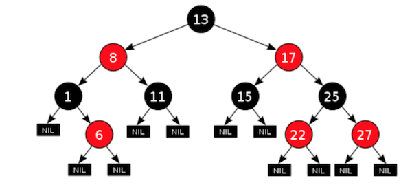

# Introduction

Ficus is a functional programming language that also supports imperative and object-oriented paradigms. Its primary application area is computing. The language includes multi-dimensional arrays as the first-class objects, they can be handled efficiently in a single or multiple threads. Ficus compiler generates portable C/C++ code out of .fx sources, and it's well-compatible with C and C++ in both directions — it's easy to call C/C++ code from Ficus and it's easy to call the C code, generated by Ficus compiler, from user's applications.

This document gives a short and yet hopefully comprehensive introduction into the language syntax and semantics to let you start working with it. At least some basic knowledge of C/C++ or other programming languages (C#, Java, Javascript, Python, F#, OCaml, ...) is assumed, since many concepts are similar and probably not described at very fine level of details.

# License

Ficus is open-source project. The compiler, the runtime and the standard library are distributed under permissive Apache 2 license.

# Installation

Ficus compiler is implemented in Ficus. Pre-generated portable .c sources of more or less relevant version of the compiler are shipped with the distribution. The build process is quite straightforward therefore:

1. Initial version of Ficus compiler (denoted `ficus0`) is built first from the pre-generated .c sources
2. Fresh up-to-date version of Ficus compiler (`ficus`) is then built from the .fx sources.

To run this bootstrap procedure, it's enough to have C/C++ compiler and make utility installed on the machine. In particular:

## On Unix-like systems (Linux, macOS, BSD etc.)

1. Clone the repository:

  ```
  $ cd ~/myprojects # enter some directory with various user's projects
  $ git clone https://github.com/vpisarev/ficus.git
  ```

2. Go to the Ficus directory and make the Ficus compiler called ficus:

  ```
  $ cd ficus
  $ make -j8 # build ficus0, then ficus
  $ bin/ficus -run test/test_all.fx # run unit tests to make sure
                      # the produced compiler functions properly
  ```

3. you can configure environment variables to let the shell know where to find Ficus (so that ficus can be run without explicit path specification)

  ```
  $ export PATH=~/myprojects/ficus/bin:$PATH
  $ export FICUSPATH=~/myprojects/ficus/lib # to help ficus find the standard library
  ```

Note: Ficus compiler is able to find the standard library automatically, but only when `ficus` binary and the library reside in some standard locations. As soon as `FICUS_PATH` is set, for example in `.bash_profile` or a similar shell configuration file, `ficus` binary can be copied to any directory and be called from there.

## On Windows

The simplest way to run Ficus on Windows is via WSL (Windows Subsystem for Linux), where you can use exactly the same instructions as above. But also Ficus can be compiled and run natively on Windows.

1. Install Visual Studio, e.g. the Visual Studio 2019 Community Edition if you just want to play with Ficus or develop some open-source software.
2. Launch `Developer PowerShell for VS2019` from Windows menu
3. Clone the repository in the same way as on Linux using Windows version of git.
4. Enter ficus directory, type `nmake`, which is Microsoft version of make utility.
5. You are good to go. `FICUS_PATH` can also be added to the list of environment variables.

Note: It's recommended to set UTF-8 locale in Windows, since Ficus reads from the standard input and writes to the standard output in UTF8 format.

## Usage

Once you installed Ficus, you can run various examples in `ficus/examples` and try to write your own simple programs, the simplest and the most well-known of which is, of course, *hello world*. Open a text editor and type there:

```
println("Hello, world!")
```

Save it as helloworld.fx. Then run it with:

```
$ <path_to_ficus>/ficus -run helloworld.fx
```

Which will great the world. In the same directory where you put `helloworld.fx` you will find `__fxbuild__/helloworld/` subdirectory with several .c files, including `helloworld.c`, which is the output of ficus compiler. You will also see there `helloworld` (on Unix) or `helloworld.exe` (on Windows), the generated application. You can also generate the application and run it separately in two steps:

```
$ <path_to_ficus>/ficus -app helloworld.fx
$ __fxbuild__/helloworld/helloworld
```

You already know the `-app` and `-run` options of the compiler, which instruct it to compile or to compile and run the application. The comprehensive list of options can be obtained with

```
$ ficus -h
```

See also the [Appendix A](#appendix-a.-using-ficus) in the end of the tutorial.

**Note:** The option `-run` suggests that Ficus can be used as a scripting language. It compiles short programs quite fast and the delay is minimum. And most of the programmers' text editors can be customized to build and run ficus programs with a keyboard shortcut. At the same time, for now Ficus lacks the interactive mode, so called *REPL*.

**Note 2:** For more pleasant Ficus programming experience you might want to enable the syntax highlighting in your editor and use the proper fonts. In `ficus/misc` directory you will find `Ficus.tmbundle`, which you may install in [TextMate 2](https://macromates.com); or copy `Ficus.tmbundle/Syntaxes/Ficus.tmLanguage` into `Packages/User/` directory with [Sublime](https://www.sublimetext.com) settings. Visual Studio Code, for some magical reason, highlights ficus code out-of-the-box. Support for other popular editors is coming. As for the fonts, since ficus syntax contains a rich set of operators, it's recommended to use the fonts with so-called programming ligatures, such as [Fira Code](https://github.com/tonsky/FiraCode), [PragmataPro](https://fsd.it/shop/fonts/pragmatapro/), [Recursive](https://github.com/arrowtype/recursive) etc.

OK, let's now learn how to program in Ficus.

# The code structure and lexical conventions

Ficus program consists of one or more source files that all have `.fx` extension. Those files are called modules. Modules may import other modules and/or be imported by some other modules. See the section [Modules](#modules) for details. Each Ficus module is utf8-encoded text file that contains a sequence of (possibly recursively nested) declarations, directives and expressions. Where it does not create a confusion, let's call them all expressions for the sake of brivity. The subsequent expressions are separated by `;` or by a newline (LF/CR/CRLF). Some expressions can span over multiple lines. In most cases Ficus can automatically separate one expression from another, but in some cases explicit `;` or parentheses `()` may be needed.

At the lower level each expression is a sequence of tokens. Tokens include operators, identifiers, keywords, literals etc. Indentation and extra spaces mostly do not matter to the compiler, use the spaces at your taste. For example, here is the example of possibly poorly formatted but still valid code:

  ```
  if a>b {
     a
  } else {println("b is the winner"); b}
  ```

here, no space is needed between `a` and `>`, `>` and `b`, even though you can put some. But a space (or a few) is needed to separate `if` from `a`. Also, `;` is needed to separate `println(...)` from `b`, since they are two subsequent expressions in the same code block on the same line.

A *space* in Ficus is the space symbol itself (`' '`, ASCII `0x20`), tabulation (ASCII `0x9`), a newline (LF/CR/CRLF), a comment, or an arbitrary combination of them.

The comments are of two types:

1. Block comments, delimited by `/*` and `*/`. Such comments can be put anywhere between tokens, can take a single line or several lines and can be nested:

  ```
  /* comment the whole thing off for now
  /*
    find the maximum of
     a and b
  */
  if a > b /* let's compare a and b */ {a} else {b /*b>=a*/}
  */
  ```

2. Single-line comments that start with `//` and take the rest of the line

  ```
  if a > b {
     a // a is the winner
  } else {
     // b is the winner,
     // and we report it
     println("b is the winner")
     b // here println() and b are separated by a newline
  }
  ```

As noticed above, sometimes a newline maybe treated as the end of one expression and beginning of another when we assume the opposite. The typical cases are:

1. breaking the line before a binary operator that can also be treated as an unary operator, i.e. `+`, `-` or `*`:

    ```
    val diff = a
           - b
    ```

   this is interpreted as `val diff = a; -b`, which is probably not what you want. In most cases such a mistake will produce a compile error message about non-void expressions in the middle of code blocks. The correct way of breaking such expressions into multiple lines is:

    ```
    val diff = a -
              b
    ```

   or

    ```
    val diff = (a   // indicate that we have a single expression by enclosing it into parentheses
               -b)
    ```

   You can also grep your source code with `^\s+[+-*]` regexp to check all the suspicious places.

2. breaking the line before the opening curly paren `(` when calling a function:

    ```
    foo
    (
       x,
       y
    )
    ```

    it will be parsed as `foo; (x, y)`, where the first expression just returns the function `foo` and the second one constructs 2-element tuple `(x, y)`. In this case the compiler will also report error about non-void expression `foo` in the middle of code block. In the case of function call attach `(` to the function name

    ```
    foo(
          x,
          y
      )
    ```

    or

    ```
    foo(x, y)
    ```

3. breaking the line before the opening square bracket `[` when accessing array or other indexable collection:

    ```
    mymatrix
        [
           i,
           j
        ]
    ```

    Just like in the case of functions, it will be parsed as `mymatrix; [i, j]`, where the first expression returns the matrix `mymatrix` and the second one constructs 2-element list `[x, y]`. Compiler will point to this issue as well. Put `[` to the same line of code and the problem is gone:

    ```
    mymatrix[
          i,
          j
      ]
    ```

    or

    ```
    mymatrix[i, j]
    ```


## Tokens

There are the following types of tokens in Ficus:

* **literals**, representing various scalar values:

  * 8-, 16-, 32- or 64-bit, signed or unsigned integers (the literals of type `int8, uint8, int16, uint16, int32, uint32, int, uint64, int64`, respectively), 16-, 32- or 64-bit floating-point numbers (of type `half`, `float` and `double`, respectively):

    ```
    42 // decimal integer
    0xffu8 // 8-bit unsigned integer in hexadecimal notation
    12345678987654321i64 // 64-bit integer,
                         // suffix i<n> denotes n-bit signed integer literals
                         // suffix u<n> denotes n-bit unsigned integer literals
                         // 64-bit integers can also use 'L' and 'UL' suffixes
                         // instead of 'i64' and 'u64', respectively.
    0777 // octadecimal integer
    0b11110000 // integer in binary notation
    3.14 // double-precision floating-point number
    1e-5f // single-precision floating-point number
         // in the expotential notation
    0.25h // 16-bit floating-point number,
         // but there is no real support
         // for such type in Ficus yet
    nan // special 'not a number' literal of double precision.
       // add 'f' suffix to get the 'single-precision' nan.
    -inff // 'minus infinity' literal of single precision.
        // remove 'f' suffix to get double-precision value.
    ```

  * boolean values (of type `bool`)

    ```
    true
    false
    ```

  * text strings (of type `string`)

    ```
    "abc"
    "hello, world!\n" // usual C-style ESC-sequences are supported

    /*
      Non-ASCII characters are captured properly
      from UTF8-encoded source,
      and then stored and processed as
      unicode (4-byte) characters.
      That is, the code will output 9
    */
    println(length("привет! \U0001F60A"))

    // It's possible to embed particular characters
    // using their ASCII or Unicode value:
    // \ooo — 1-3 digit octadecimal ASCII codes,
    // \xXX — 2-digit hexadecimal ASCII codes,
    // \uXXXX — 4-digit hexadecimal Unicode value
    // \UXXXXXXXX — 8-digit hexedecimal Unicode value
    "Hola \U0001F60A"

    // Similar to Python, f-strings may embed expression values using {} string interpolation construction
    val r = 10
    println(f"a circle with R={r} has area={3.1415926*r*r}")
    // the line above is converted by the parser to
    println("a circle with R=" + string(r) +
           " has area=" + string(3.1415926*r*r))

    // therefore, custom objects can also be interpolated
    // once you've provided string() function for them:
    type point = { x: int; y: int }
    // note that to avoid confusion, literal '{' and '}'
    // need to be duplicated in f-strings
    fun string(p: point) = f"{{x={p.x}, y={p.y}}}"
    val pt = point { x=10, y=5 }
    println(f"pt={pt}")

    // Multi-line string literals are possible too:
    // By default, end-of-line characters in the produced
    // string are retained. \r\n is replaced with \n for
    // cross-platform compatibility.
    val author="anonymous"
    f"multi-line
      strings
        are
      delimited
     by quotes, just like the normal string literals
       and can also embed some values.
            {author}
    "
    // Put \ before a newline to remove this newline and
    // the subsequent spaces from the literal
    val errmsg = "A very long and \
       detailed error message explaining \
       what's going wrong."

    // r-string literals are mostly used for regular expressions,
    // because they let to specify character classes and other
    // special symbols without duplicating '\'
    val assigment_regexp = Re.compile(
      r"(?:val|var)\s+([\a_]\w+)\s*=\s*(\d+|\w+)")
    ```

  * characters (of type `char`) — this is what the text strings are made of. Character literals look exactly like single-line text literals, but are enclosed into single quotes.

    ```
    chr(ord('A')) == 'A' // ~ true
    ```

  * polymorphic literal — an empty list, vector or 1D, 2D etc. array (of type `'t list`, `'t vector`, `t []`, `t [,]` etc., respectively)

    ```
    []
    ```

  * null C-pointer (see the section about interaction with C/C++)

    ```
    null
    ```

* **identifiers** — they denote all the named entities, built-in or defined in the code: values, variables, functions, types, exceptions, variant tags etc. An identifier starts with the underscore `_` or a letter (Latin or not) and contains zero or more subsequent underscores, letters or decimal digits, i.e. it can be defined with the following regular expression: `[\a_]\w+`. Identifier `_` has a special meaning. It denotes an unused function parameter or, in general, element of a pattern that user does not care of (patterns are discussed further in this document).

* **keywords** — they look like identifiers and are used to form various syntactic constructions. You may not have an identifier with the same name as keyword. Here is a list of Ficus keywords:

  ```
  as break catch class continue do else exception
  false finally fold for from fun if import inf inff
  interface match nan nanf null operator ref throw
  true try type val var when while
  ```

  There are also **attribute-keywords** that start with `@` and are used to describe various properties of defined symbols, for-loops, code blocks etc. Here they are:

  ```
  @ccode @data @inline @nothrow @pragma
  @parallel @private @pure @sync @text @unzip
  ```

  The names of standard data types can also be treated as keywords:

  ```
  int8 uint8 int16 uint16 int32 uint32 int uint64 int64
  half float double bool string char list vector cptr exn
  ```

  But the important difference is that it's possible to define a function or a value with the name that matches the standard data type. In particular, it's the common practice — to give the name of target datatype to the type cast function:

  ```
  fun string(set: 't Set.t) =
    join_embrace("{", "}", ", ", set.map(repr))
  type ratio_t = {n: int; d: int}
  fun double(r: ratio_t) = double(r.n)/r.d
  ```

* **operators**

  There are quite a few operators, binary and unary.

  **Binary**:

  ```
  // overridable binary operators
  + − * / % **
  .+ .- .* ./ .**
  == != > < <= >= <=> ===
  .== .!= .> .< .<= .>= .<=>
  & | ^ >> << \

  // other binary operators
  .{...}

  = += −= *= /= %= &= |= ^= >>= <<=
  .={...}

  && || :: :>
  ```

  **Unary**

  ```
  // overridable prefix operator
  ~
  // other prefix operators
  + − *
  .- ! \

  // overridable postfix operator
  '
  ```

  The overridable operators can be enclosed into `()` and be used as identifiers, e.g. to pass to a higher-level function. Also, such operators can be overridden using `operator` keyword:

  ```
  type ratio = { n: int; d: int }
  operator < (r1: ratio, r2: ratio) {
    val scale = r1.d*r2.d
    if scale > 0 {r1.n*r2.d < r2.n*r1.d}
    else {r1.n*r2.d > r2.n*r1.d}
  }
  fun R(n: int, d: int) = ratio {n=n, d=d}
  val sorted = [R(1,2), R(3,5), R(2,3)].sort((<))
  ```

* There are also various **delimiters** and **parentheses**

  ```
  -> => <- @ . , : ; [ ] [< >] [| |] ( ) { }
  ```

All these operators will be explained later in the tutorial.

Now let's make a step up and see how various language constructions are composed out of the tokens

# Values and Variables

As mentioned before, a Ficus source is a sequence of *expressions* that are classified as expressions themselves, declarations and directives. Directives are used to import modules (described in the *Modules* section) and to provide instructions to the compiler via pragma's. Declarations introduce new named entities:

* values and variables
* functions
* types, including classes
* interfaces
* exceptions

Expressions are used to initialize values and to perform various actions, such as print "hello, world!".

Expressions are described in the next sections, and various complex declarations are covered in the next sections. Let's now  start with one of the basic and yet most important concept of each programming language, values and variables.

Values are variables are essentially named entities that are associated with some data and that can be used to pass the data to and from the processing algorithms. What is the difference between values and variables?

* Values are assigned exactly once, during their declaration, and then they cannot be changed.
* Variables, on the other hand, can be assigned a new value after they are initialised.

Most languages support both values and variables, but in imperative languages variables is the default and the recommended choice, whereas in functional languages values take the preference. Ficus supports both functional and imperative styles, but it's mainly a functional language, so it encourages you to use values. For example, in the current Ficus compiler, implemented in Ficus itself, there are ~4500 value declarations and just ~450 variable declarations. That is, variables are used 10x less frequently than values. Declarations of values and variables look very similar:

```
val <value_name> [ : <optional type spec>] = <expression>
var <variable_name> [ : <optional type spec>] = <expression>
```

You can read the values, and you can read and write variables. The type of declared value or variable is inferenced in most cases, but sometimes you need to specify it explicitly. Let's consider some examples:

```
val a = 5
var b = "abc"
val c = a + 1, d = string(c) // define two values

// error: each value or variable must be
// initialized explicitly
var x : float;

b += "def" // b becomes "abcdef"
b = 3.14  // error: a variable can change
          // its value, but not its type
a = c + 2 // error: values cannot be re-assigned
var curr_list : int list = [] // explicitly specify
          // that we have an empty list of integers here
curr_list = 5 :: curr_list // append 5 to the beginning
                           // of the list
```

C/C++ users may think of a value as of a `const` variable, and, indeed, the concepts are very similar. But there is one important difference. A value may not be re-assigned, but if it holds a mutable object, e.g. array, you can still modify parts of the object, e.g. array elements:

```
val m3x3 = array((3, 3), 1.f) // make 3x3 floating-point matrix,
                              // filled with 1's.
m3x3[0, 0] = 0.f // change the top-level element to zero.
m3x3[:,:] = m3x3 * m3x3 // replace the whole matrix
                        // with its square
m3x3 = m3x3 * m3x3 // error: you cannot reassign the value
```

You may ask, why to use values when variables are just as easy to declare and are more flexible? Well, it is much easier for a compiler to optimize the code that uses values rather than variables, it's easier for 3rd-party code analysis tools to check such a code. Also, common wisdom says that a functional-style code that uses mostly immutable values and has few side effects often has less bugs and easier to debug than an imperative code that is basically made of side effects. How far can we get by using just values? In theory (i.e. the lambda calculus), any arbitrarily complex algorithm can be implemented using recursion, immutable data structures and values. For example, here is how you can obtain a sequence of first `n` Fibonacci numbers without using variables:

```
fun fibseq(n: int)
{
    fun fib_(i: int, a: int, b: int, n: int, result: int list)=
       if i < n {fib_(i+1, a+b, a, b::result)}
       else {result.rev()}
    fib_(0, 1, 1, n, [])
}
println(fibseq(30))
```

## Reusing a value name

There are cases when a value is computed using a complicated procedure, and so instead of having a single very complex expression we compute it step by step:

```
val a0 = compute_initial_a()
val a1 = if a0<0 {foo(a0)} else {a0}
val a2 = bar(a1)
val a3 = baz(a2)
...
```

The code looks ugly and is error-prone, e.g. we can suddenly mistype `a2` as `a1` in `a3` definition. To address this problem, in Ficus you can reuse the same value name multiple times:

```
val a = compute_initial_a()
val a = foo(a)
val a = bar(a)
val a = baz(a)
...
```

It looks as if `a` was a variable, but internally compiler creates a new fresh name for each defined `a`, i.e. internally, after the type checker compiler phase, it will represent the code above as something like:

```
val a_1234 = compute_initial_a_780()
val a_1235 = foo_542(a_1234)
val a_1236 = bar_601(a_1235)
val a_1237 = baz_927(a_1336)
...
```

## Unpacking structures when defining values

You can define multiple values at once by unpacking a tuple, a record or a single-case variant. All those structures, as well as *pattern-matching* expressions, are discussed later, but let's present the simplest and the most frequently used form of such construction:

```
val /* or var */ (x1, x2, ..., xn) = expr
```

You can use `_` instead of some of `xj`, when you do not need particular values. Also, this unpacking may be done recursively:

```
// redefine the new a as min(a, b)
// and at the same time the new b as max(a, b)
val (a, b) = (min(a, b), max(a, b))
val person_info = ("Joe", "male", 180, 75, (1980, 5, 1))
val (name, gender, height, weight, (year, _, _)) = person_info
```

# Expressions

Ficus includes the standard set of arithmetic expressions. Also, since it's a functional language, many of the complex control-flow operators that are usually statements in imperative languages are also expressions, and so they can be nested into other expressions:

```
val rng = RNG(0x123u64)
println(if bool(rng) {"heads"} else {"tails"})
```

note that this `if` expression is not a ternary operation like in C/C++, it's a full-scale conditional operator and you can put as much stuff into `then` and `else` branches as you want, including value and function definitions etc.

Operators form the foundation of expressions. The table below describes Ficus operations, ordered by priority (from the lowest to the highest):

| operation                    |  priority  | associativity  |  result type |  description             |
|------------------------------|------------|----------------|--------------|--------------------------|
| *exp1* = *exp2*               |     1      |      left      |  void | assign a new value. Note that assignments cannot be chained in Ficus |
| *exp1* *op*= *exp2*           |     1      |      left      |  void | Augmenting assignment operations. Equivalent to *exp1* = *exp1* *op* *exp2* |
| *exp1* : *typespec*         |     2      |      N/A       |  *typespec* | explicitly specifies type of the expression to assist the type checker. Because of very low priority this operator is typically enclosed into parentheses |
| *exp1* :> *typespec*        |     2      |      left      |  *typespec* | casts expression to the specified type. Also enclosed into parentheses most of the time |
| *exp1* : *exp2* or *exp1* : *exp2* : *exp3*    |     2      |     left       |  a range     | specifies a range when a part of array is accessed or inside for-loop. The optional *exp3* specifies the increment, otherwise it's 1.
| *exp1*  &#124;&#124;  *exp2*  |     3      |     left       |  bool        | logical or. *exp2* is computed only when *exp1* is false |
| *exp2*  &&  *exp2*            |     4      |     left       |  bool        | logical and. *exp2* is computed only when *exp1* is true |
| *exp1* *cmpop* *exp2* [*cmpop *exp3* ...]         |    5      |      left      |  bool       | *cmoop* denotes various comparison operations: `==`, `!=`, `>`, `<`, `>=`, `<=`. The comparison operations may be chained (e.g. `-1<=x<=1`) |
| *elem*  :: *list*             |     6      |     right      |  same as *list*      |  construct a list from an element and the  specified tail |
| *exp1*  &#124; *exp2*         |     7      |      left      |  same as *exp1* and *exp2* | bitwise or. Because &#124; is also used in pattern matching, sometimes (rarely) you will need to enclose this in parentheses to distinguish between the two use cases |
| *exp1* ^ *exp2*               |     8      |      left      |  same as *exp1* and *exp2* | bitwise "exclusive or" |
| *exp1* & *exp2*               |     9      |      left      |  same as *exp1* and *exp2* | bitwise and |
| *exp1* <=> *exp2*               |     10      |      left      |  int | so-called *spaceship* operator that returns -1, 0 or 1 if *exp1* < *exp2*, *exp1* == *exp2* or *exp1* > *exp2*, respectively |
| *exp1* .*cmpop* *exp2*               |     11      |      left      |  bool *collection* | element-wise comparison operation |
| *exp1* .<=> *exp2*               |     12      |      left      |  int *collection* | element-wise spaceship operator |
| *exp1* === *exp2*               |     12      |      left      |  bool | equivalence operator, checks if two arrays, lists, references, strings etc. are not just equal, but they point to the same object. For scalar stack-allocated values it's equivalent to `==` operator |
| *exp1* << *exp2*, *exp1* >> *exp2* |  13   |  left  |  same as *exp1* and *exp2* | shift operations on integers |
| *exp1* + *exp2*, *exp1* − *exp2* |  14   |  left  |  coerce(*exp1* type, *exp2* type) | arithmetic operators. For lists, strings and vectors `+` works as a concatenation operator. For arrays it works as `.+` |
| *exp1* .+ *exp2*, *exp1* .— *exp2* |  14   |  left  |  coerce(*exp1* type, *exp2* type) | defined for the arrays; equivalent to the above |
| *exp1* &#42; *exp2*, *exp1* / *exp2*, *exp1* % *exp2* |  15   |  left  |  coerce(*exp1* type, *exp2* type) | more arithmetic operators. For arrays &#42; does the matrix multiplication; `%` computes a signed reminder, as defined in C/C++ standards. |
| *exp1* &#92; *exp2* | 15 | left | usually the same as *exp1* type | The inverse division operator; used to solve linear systems `A\b` and invert matrices `A\1` |
| *seq* &#42; *n*, *n* &#42; *seq* |  15   |  left  |  the same as *seq* | another role of &#42; operator — replicate a string or a list *n* times. Replicating something 0 times yields an empty string/list |
| *exp1* .&#42; *exp2*, *exp1* ./ *exp2* |  15   |  left  |  coerce(*exp1* type, *exp2* type) | defined for the arrays; element-wise multiplication and division |
| *exp1* &#42;&#42; *exp2*, *exp1* .&#42;&#42; *exp2*, | 16 | right | coerce(*exp1* type, *exp2* type) | "raise-to-power" and element-wise "raise-to-power" operation |
| +*exp*, —*exp* | 17 | right | coerce(*exp* type, *exp* type) | unary plus and minus operations |
| .—*exp* | 17 | right | coerce(*exp* type, *exp* type) | unary dot-minus operation. It's currently used to access the last, pre-last etc. elements of collections, e.g. `str[.-1]` is the last element of string |
| !*exp*    | 17 | right | bool  | logical inversion |
| ~*exp*    | 17 | right | same as *exp* | bitwise inversion |
| &#92;*exp*  | 17 | right | N/A | *expand* operator. It's used in the array composition operators. `[| \A, \B |]` concatenates columns of the two 2D arrays (which must have the same number of rows), whereas `[| A, B |]` is 2-element array of arrays. |
| ref *exp*    | 17 | right | *T ref*, if *exp* has type *T* | creates a new reference with initial value *exp* |
| *exp*'  | 18 | left | usually same as *exp* | *apostrophe* operator. For matrices it denotes transposition; for other types it can be redefined, e.g. it may denote a function derivative. |
| &#42;*exp*  | 19 | right | when *exp* has *T ref* type, the result will have *T* type | dereference a reference |
| *exp1*.*name*  | 20 | left | type of the accessed member |access record |
| *exp1*->*name*  | 20 | left | type of the accessed member | deference and access the record, equivalent to `(*exp1).name` |
| *exp1*.*number* | 20 | left  | type of the accessed member |access tuple |
| *exp1*->*number* | 20 | left  | type of the accessed member |dereference and access tuple |
| *exp1*->*number* | 20 | left  | type of the accessed member |dereference and access tuple |
| *exp1*.{*name2*=*exp2*, *name3*=exp3", ...} | 20 | left | the record type | create a copy of record *exp2*, where *name2* gets the new value *exp2*, *name3* gets the value *exp3* etc. Unmentioned record fields remain unchanged. |
| *exp1*->{*name2*=*exp2*, *name3*=exp3", ...} | 20 | left | the record type | the version of the above operator that dereferences *exp1* first. |
| *exp1*[*exp2*,*exp3*,...] | 20 | left | the element type if all indices are scalar; *exp1* type if all indices are ranges |accesses array, string or vector. Each of the *exp2*, *exp3* etc. is can be a scalar index or a range expression (*a* : *b* [: *optional_step*]) |
| *exp1*(*exp2*,*exp3*,...) | 20 | left | the function result type | call the function with certain arguments |
| (*exp1*) | ∞ | N/A | same as *exp1* | enclose arbitrarily complex expression into parentheses to control the order of calculations |
| ({*code_block ...*}) | ∞ | N/A | same as the last expression of *code_block* | inside parentheses it's possible to put curly braces and inside them put arbitrary sequence of declarations and expressions. The value of the last expression in the code block is the value of whole code block.|
| (*exp1*, *exp2*, ...) | ∞ | N/A | the tuple type | form a tuple of values. They may have different types. |
| [*exp1*, *exp2*, ...], [&lt; *exp1*, *exp2*, ... &gt;], [&#124; *exp1*, *exp2*, ... &#124;] | ∞ | N/A | the type of constructed collection | form a list, a vector or an array of values, respectively. All the values must have the same type. In  the case of arrays it's also possible to use expand operator `\`  and put `;` to separate one row from another (to form a 2D array instead of 1D) |
| [for ...], [&lt; for ... &gt;], [&#124; for ... &#124;] | ∞ | N/A | the type of constructed collection | form a list, a vector or an array using comprehension. See the [Arrays](#arrays) and [Comprehensions](#comprehensions) sections for details |
| *name1* {*name2*=*exp2*, *name3*=*exp3*, ...} | ∞ | N/A | the record type | form a fresh record of type *name1* by specifying its members' values |

As in the case of other languages, the precedence and associativity rules minimise the use of `(` `)` in many cases, but you can explicitly enclose some sub-expressions into parentheses to change the evaluation order.

What is `coerce(T1, T2)` in the table? This is the type computed out of `T1` and `T2`; it's wide enough to avoid truncation of the operation result (in most cases). See [Numbers](#numbers) section for the comprehensive definition of coercion.

Besides the basic operations shown in the table above, there are many other expressions, described in the respective sections (even though some of them have been mentioned briefly in the table):

* Flow control expressions — described in [Code Blocks and Flow Control Operations](#code-blocks-and-flow-control-operations) section
* Array construction and access operations, array comprehensions — covered in the [Arrays](#arrays) section
* Constructing tuples and records, accessing them — see [Tuples and Records](#tuples-and-records)
* Pattern matching expressions — see [Pattern Matching](#patterns)
* Constructing and processing variants — see [Sum Types or Variants](#variants)
* Function and method calls, lambda functions — see [Functions](#functions)
* Throwing and handling exceptions — see [Exceptions](#exceptions)

# Types

Ficus is a strictly and statically typed language, that is, each value has a type that is determined at compile time. In the case of values and variables their types are often inferenced automatically, and usually you can omit the type specifications. In some other cases you need to specify types explicitly, e.g. when you define a function, you should specify types of the arguments. If a value is not typed explicitly and if compiler could not infer its type, it will report an error. That is, if a program compiles successfully, all the values there have definite types.

Except for the *classes* and *interfaces*, which use a different syntax, new types can be defined with:

```
type typename = <type definition body>
```

where type definition body is a type alias, a record or a variant. For example:

```
type point = (int, int)
type DComplex = {re: double; im: double}
type contour_t = point vector
```

In the case of generic types (see [Generic Programming](#generic-programming) section for details) the syntax is a bit more complex:

```
// single-parameter case
type 't typename = <type definition body>
or
// multiple-parameters case
type ('t1, ..., 'tN) typename = <type definition body>
```

for example

```
type 't Complex = {re: 't, im: 't}
type ('key, 'data) hashtable_t =
{
    hash_func: 'key -> uint64;
    table: (uint64, 'key, 'data) [] ref;
}
```

*A short **note** about `'t` notation: an identifier with `'` prefix inside a type declaration/specification denotes so-called type variable. In C++ terms it's a template `typename` parameter. When the type is instantiated, some concrete type must be put instead of `'t`. If the same name occurs several times in a type specification, it means that the same concrete datatype should be used there. If different identifiers are used, they may correspond to different concrete types or the same type. The notation is a bit different from some other languages, where type arguments follow the generic type name in angle brackets, e.g. `vector<int>` in C++. In Ficus the argument or argument(s) are put in front: `point vector`, `float Complex` etc.*

Here is how the above-defined generic and non-generic types can be used:

```
fun convexhull(c: contour_t): contour_t { ... }
// correct: we explicitly specified the value type,
// but we do not have to. It can be inferenced automatically
val contour: (int, int) vector =
      [<(0, 0), (10, 0), (1, 1), (0, 10)>]
// correct: contour_t === point vector === (int, int) vector
// the type of chull is automatically inferenced
val chull = convexhull(contour)
// correct: redefine value 'contour' as (float Complex) vector.
// the previous 'contour' is now hidden.
// no need to declare this type in advance
val contour =
      [<Complex {re=0.f, im=0.f}, Complex {re=10.f, im=0.f},
       Complex {re=1.f, im=1.f}, Complex {re=0.f, im=10.f}>]
// error: convexhull expects (int, int) vector.
val chull_f = convexhull(contour)

fun conj(c: DComplex) = DComplex {re=c.re, im=-c.im}

// error: DComplex is expected, 'double Complex' is provided.
// the two structures have identical content,
// but different names.
val xc = conj(Complex {re=5., im=1.})

// define alias for for the particular instance of hashtable_t
type phonebook_t = (string, int) hashtable_t

// define a function that uses another instance of hashtable_t
fun translate(word: string, dict: (string, string) hashtable_t)
{ ... }
```

In general, the types in Ficus can be divided into 3 categories:

1. primitive or scalar data types: numeric types (see below), `bool`, `string`, `char`, `void`, `cptr`
2. unnamed complex data types that are build recursively out of scalar data types and other compound data types, named or unnamed. Such types are matched by their structure. You may give aliases to such types, but the aliases will still be treated as identical types as long as they structurally equivalent. This category includes `ref`'s, `list`'s, `array`'s, `tuple`'s, `vector`'s, functions, as well as instances of generic types (e.g. `float Complex` or `(string, int) hashtable_t` in the previous example).
3. named complex data types. Each of them requires explicit declaration, where you give it a name. And the types are compared by their name. Two types with different names are considered different, even they have absolutely the same content (unless one of the types is defined explicitly as an alias for the other type, then they will be considered as equal). The named complex types are `record`'s, `variant`'s (or sum types), `class`'es and `interface`'s.

Types from the first two categories can be used anonymously, without defining any aliases. Types from the 3rd category can only be referenced by their names.

## The list of types

Ficus includes the following built-in, automatically defined and user-defined types:

* integer and floating-point numbers of various bit depth:
    * `int` — the most used type. It's signed integer type of the same size as pointer, i.e. 32-bit integer on 32-bit machines, 64-bit integer on 64-bit machines etc.
    * `uint8` — unsigned 8-bit integers within 0..255 range. `uint8` literals have `u8` suffix.
    * `int8` — signed 8-bit integers within -128..127 range. The literals have `i8` suffix.
    * `uint16` — unsigned 16-bit integers within 0..65535 range. The literals have `u16` suffix.
    * `int16` — signed 16-bit integers within -32768..32767 range. The literals have `i16` suffix.
    * `uint32` — unsigned 32-bit integers within 0..2^32-1 range. The literals have `u32` suffix.
    * `int32` — signed 32-bit integers within -2^31 .. 2^31-1 range. The literals have `i32` suffix. Note that int32 and int are not converted one to another implicitly.
    * `uint64` — unsigned 64-bit integers within 0..2^64-1 range. The literals have `u64` or `UL` suffix.
    * `int64` — signed 64-bit integers within -2^63 .. 2^63-1 range. The literals have `i64` or `L` suffix.
    * `half` — 16-bit floating-point numbers. Currently, Ficus has no real support for such type, it's reserved for the future. The literals have `h` suffix.
    * `float` — single-precision (32-bit) floating-point numbers, as defined by IEEE754 standard. The literals have `f` suffix.
    * `double` — double-precision (64-bit) floating-point numbers, as defined by IEEE754 standard.

  The numbers are further covered in the [Numbers](#numbers) section.

* boolean type `bool` that has only two possible values: `true` and `false`. There is no implicit conversion between `bool` and integer types; do it explicitly:

  ```
  val nz_x = x != 0
  val x = if nz_x {1} else {0}
  val y = int(nz_x) // get the same result as above
  val x = (nz_x :> int) // explicit type cast notation
  ```

* type `void`. It's not a first-class type, as in some other functional languages. It can only be used to specify a function return type or specify that the function does not take any parameters.

* The type `string` represents Unicode strings. The string literals have been discussed earlier and the further [Text Strings](#strings) section covers text strings in more details.

* The type `char` represents a single unicode character.

* type `cptr` represents an opaque pointer to a C structure. It's not a plain pointer, it is actually a "box", containing the plain pointer, the reference counter and the user-provided destructor (which is invoked when the reference counter reaches 0). The type is used to store and handle various C structures used in Ficus, e.g. file handles, mutexes etc. See [Interoperability with C](#interoperability-with-c) for details.

* **function**: `'t1 -> 'rt` (single parameter case), or `('t1, 't2, ..., 'tn) -> 'rt` (multiple parameter case) or `void -> rt` (no parameters case). If a function does not return any value, the `'rt` is `void`. The functions are described in details in **Functions** section. Here is a short example to illustrate the type use:

    ```
    fun tabulate(a: double, b: double,
               n: int, f: double->double) =
    [| for i <- 0:n {
        val x = (b - a)*i/(n-1) + a
        f(x)
    } |]
    val cosine_tab = tabulate(0., 6.28, 256, cos)
    ```

* **tuple**: `('t1, 't2, ..., 'tn)`. Tuple instances are created by enclosing several comma-separated values into parentheses. There is no need to explicitly define a tuple type before constructing its instance. Individual elements of tuple are accessed using `tuple_val.integer_literal` notation or using pattern-matching:

    ```
    val label_color = (0u8, 255u8, 0u8)
    val detected_object_info=((100, 200, 50, 100),
                            label_color, "pedestrian")
    val bounding_box = detected_object_info.0
    val (_, _, label) = detected_object_info // extract the label
    ```

  A shorter notation `('t * N)`, where `N` is integer literal, can be used to define a tuple type of `N` elements of the same type, for example:

    ```
    fun cmul(a: (float*2), b: (float*2)) =
     (a.0*b.0 - a.1*b.1, a.0*b.1 + a.1*b.0)
    ```

* **record**: `type type_params record_name = { name1: 't1; name2: 't2; ... }`. Records may be viewed as tuples with named elements. Unlike tuples, the record types should be defined explicitly before you use them:

    ```
    type rect = { x: int; y: int; width: int; height: int }
    type detected_object_info_t // '=' can be omitted when defining a record
    {
        bounding_box: rect // newline can be used as a separator
        label_color: (uint8*3)
        object_class: string
    }
    val detected_object_info = detected_object_info_t {
        bounding_box=rect{x=100, y=200, width=50, height=100},
        label_color=(0u8, 255u8, 0u8),
        object_class="pedestrian" }
    val bbox = detected_object_info.bounding_box
    val center = (bbox.x + bbox.width/2,
                bbox.y + bbox.height/2)
    ```

* **reference**: `'t ref`. Reference is a structure allocated in a heap that contains a value of the specified type and the reference counter. You can access and modify the stored value:

    ```
    var a = "to be" // initialize a variable
    val b = ref a   // create a reference with the same value
    a += " or not to be" // modify a, but *b stays the same
    println(*b)     // outputs "to be"
    b = ref "hello" // error: b cannot be assigned, it's a value
    val c = b     // copy the reference, share the content
    fun append(sr: string ref, delta: string) = *sr += delta
    append(c, " or not to be") // correct, change the c's
                             // (and b's) content
    println(*b)   // outputs "to be or not to be"
    ```

  C/C++ users may treat references as the constant pointers (`int ref` in Ficus ~ `int* const` in C++). Also, note that in Ficus there is no unary `&` operator, that is, you cannot take address of an existing object. Instead, `ref` operator always allocates a new object in the heap and assigns to it the user-specified initial value, which can further be changed.

* **option**: `'t?`, e.g. `int?`, `(string, string) list?` etc. Represents 'some value' or 'nothing'. Strictly speaking, it's a partial case of variant, which is discussed later in the tutorial. But it's so common and so useful that it got the special syntax (`?`). If  `x` is a value of type `T`, `Some(x)` would be a value of type `T?`. What about 'nothing'? Use `None`. Most of the time Ficus compiler will guess correctly, which `T?` it will belong to. When it's not, use explicit type specification, e.g. `(None : int?)`. Here is an example:

    ```
    // convert string to int, if it's possible
    fun str2int(s: string): int?
    {
        var result = 0, sign = 1, start=0
        if s.startswith('-') {sign = -1; start=1}
        for i <- start:s.length() {
            val c = s[i]
            if '0' <= c <= '9' { result = result*10 + (ord(c) - '0') }
            else { result = -1; break }
        }
        if result >= 0 { Some(result*sign) } else { None }
    }

    val x = str2int("-123") // Some(-123)
    val y = str2int("abc")  // None
    println(x.issome()) // prints 'true'
    println(y.isnone()) // prints 'true'
    println(x.value_or(0)) // prints '-123'
    println(str2int("1h").value_or(-1)) // prints '-1'
    // throws exception 'OptionError'
    val z = str2int("123456789").value() + // 123456789 + ...
            str2int("not a number").value() // the exception occurs here
    ```

* **array**: `'t []` — 1D array, `'t [,]` — 2D array, `'t [,,]` — 3D array etc. The type represents dense 1D or multi-dimensional arrays (currently, the compiler supports up to 5D arrays). All elements of array must have the same type. Size of an array can be arbitrary, but it's fixed at the moment of creation:

    ```
    // create a small 1D array (of type int [])
    // by listing its elements
    val small_arr = [| 1, 2, 3, 4, 5 |]
    // error: all array elements must have the same type
    val err = [| 1, 2, 3, 4, 5. |]
    // array of arrays is also possible, of course.
    // it will have type int [][]
    // ( can also be denoted as (int [])[] )
    val pascal_triangle =
    [|
        [| 1 |],
        [| 1, 1 |],
        [| 1, 2, 1 |],
        [| 1, 3, 3, 1 |],
        [| 1, 4, 6, 4, 1 |]
    |]
    val alpha = 30*M_PI/180
    // 2D arrays can also be initialized by listing its elements,
    // where rows are separated by ';'
    // rotation_mtx will have 'float [,]' type
    val rotation_mtx =
        [| cos(alpha), -sin(alpha);
            sin(alpha), cos(alpha) |]
    // error: all rows of 2D array must have the same size
    val pascal_triangle_err =
    [| 1; 1, 1; 1, 2, 1; 1, 3, 3, 1; 1, 4, 6, 4, 1 |]

    // create 2D array, which elements are all
    // set to the same value ((0,0,0) in this case)
    // m will have '(uint8, uint8, uint8) [,]' type
    val image = array((480, 640), (0u8, 0u8, 0u8))

    // access element at row=1, column=2.
    image[1, 2] = sat_uint8(image[1,2] + (10, 10, 10))

    // invert the rectangle 30<=row<200, 50<=column<200 inside array
    image[30:200,50:200] ^= (255u8, 255u8, 255u8)
    ```

* **list**: `'t list`. List is an immutable single-connected list. All the elements must have the same type. There are 4 basic operations on lists: `List.hd()`, `List.tl()`, `::` (called *CONS* operation) and `List.empty()` (check for emptiness). List literals are made with `[: elem1, elem2, ..., elemn :]`:

    ```
    // make a list of 5 consequitive natural numbers
    val mylist1 = [1, 2, 3, 4, 5]
    val hd1 = mylist1.hd() // 1
                           // mylist1.hd() is equivalent to
                           // List.hd(mylist1)
    val tl1 = mylist1.tl() // [2, 3, 4, 5]
    val mylist2 = 100 :: tl1 // [100, 2, 3, 4, 5]

    // can also build a list using '::' operator.
    val mylist3 = "a" :: "b" :: "c" :: "d" :: []
    val phone_book = ("Peter", 12345678) ::
                    ("Ann", 131415926) :: []

    // here is how some computer vision function
    // may look like - take an image on input
    // (represented by a 2D array of bytes) and
    // return a list of detected objects
    // (see the records description above for
    // example detected_object_info_t definition)
    fun detect_objects(image: uint8 [,]) :
        detected_object_info_t list = { ... }
    ```

  note that you cannot modify a list, you can only decompose it and create a new list out of a part of an old list and some new elements that are always added in front.

* **vector**: `'t vector`. Vector is an immutable 1D array built on top of so-called "Relaxed Radix Balanced trees" with quite efficient random access, iteration, slicing and concatenation operations.:

    ```
    val small_vector = [<1, 2, 3, 4, 5>]

    // make big vector [<1, 2, 3, ..., N>]
    val N = 1000000
    val big_vector = [< for i <- 0:N {i+1} >]

    // random vector access is ~O(1) operation,
    // so the following loop is reasonably fast
    var sum = 0.
    val rng = RNG(0x123u64)
    for i <- 0:100000 { sum += big_vector[rng.uniform(0, N-1)] }

    // make a new vector that includes the first 100K
    // and the last 200K of elements of big_vector.
    // It'a also a fast operation.
    val removed_middle = big_vector[:100000] +
                        big_vector[800000:]

    // make a list with the same content as big_vector
    val big_list = [for i <- 0:N {i+1}]

    // may take forever, because accessing
    // n-th element of a list takes O(n) time.
    for i <- 0:100000 { sum -= big_list.nth(rng(0, N)) }
    ```

  In principle, i-th element of vector can be ‘modified’ more or less efficiently with `vec[:i] + [new_value] + vec[i+1:]`, but if you modify elements quite often, an array may be a better (10x-100x better) option.

* **variant**, also known as sum type: `Tag1: 't1 | Tag2: 't2 | ...`. Variants are used to represent various data structures from from simple enumerations to very complex hierarchical data structures. We cover them in the dedicated section.

* **instance** of a generic type: `'t generic_type_name` (the case of generic type with a single parameter) or `('t1, 't2, ..., 'tN) generic_type_name` (the case of multiple type parameters). Some built-in types, like arrays, lists, vectors or references, act as generic types and ‘instantiated’ in the same way. The instantiation can also be done recursively, i.e. some of 'tj` may also be instances of generic types:

    ```
    // 2D array of references to integers
    type cell_matrix = int ref [,]

    // a graph, represented as a list of pairs
    // (vertex, <list of connected vertices together
    //            with the edge weights>)
    type graph_t = (int, (int, double) list) list

    import Map
    // associative container with string keys and integer values
    type str2int_map_t = (string, int) Map.t
    ```

  In the second example it may look like the outer list is instantiated with 2 type arguments. But since the compiler always knows how many parameters each generic type has (the `list` has 1), it correctly interpreters `(int, (int, double) list)` as the single type argument.

* **class** and **interface**. These two are used to represent classes and abstract interfaces, respectively. See [Object-Oriented Programming](#oop) section for details.

* **exception**. `exn`. Exceptions is a classical error processing mechanism that is often preferable to the manual function return value inspection. Similarly to some other functional languages, such as OCaml or F#, and unlike some traditional languages, such as C++ or Python, exceptions in Ficus are not instances of classes, possibly derived from a certain base class. Instead, they are instances of the special type `exn`. New exceptions are introduced using `exception` keyword where at minimum the name of the new exception is specified and at maximum some extra attributes are added to the exception (i.e. the information that you want to pass when the exception is thrown). See the section [Exceptions](#exceptions) for details.

# Code Blocks and Flow Control Operations

## Code Blocks

*Code block* is simply a sequence of expressions enclosed in curly braces and separated by `;` or a newline. That is, it looks like:

    ```
    {
        expr1
        expr2; expr3
        ...
        expr_n
    }
    ```

The formatting is almost arbitrary:

a)
    ```
    { expr1; expr2; ... ; expr_n }
    ```

b)
    ```
    { expr1
    expr2
    ...
    expr_n }
    ```

etc.

Note that some of the expressions may actually be declarations of values, functions, types etc.

Code block is also an expression, its type and its value matches the type and the value of the last expression in the block. The empty code block `{}` has type `void`.

You can put a code block anywhere where a single expression is expected, in which case you need to enclose this sequence into parentheses and curly braces `({ ... })`. Many expressions in Ficus, like conditional expressions, loops, pattern matching, try-catch etc. expect code blocks as their parts, and then only `{ ... }` should be used without `( ... )`:

    ```
    // Parentheses and curly braces are necessary here,
    // because the compiler expects a single expression after "if".
    // Such coding style is difficult to recommend, though
    if ({ val diff=x - y;
        -10 <= diff && diff < 20 }) {
        // then- and else- branches are expected
        // to be code blocks, so the curly braces are necessary
        print("condition is true"); foo()
    }
    else
    {   // here curly braces can be put immediately after 'else'
        // or on a separate line
        bar()
    }

    // the function body can be a single expression, following =,
    // or a code block, in which case '=' should be omitted
    fun sort3(a: int, b: int, c: int): (int, int, int)
    {
        val (a, b) = (min(a, b), max(a, b))
        val (b, c) = (min(b, c), max(b, c))
        val (a, b) = (min(a, b), max(a, b))
        (a, b, c)
    }
    ```

As mentioned earlier, the type of code block is defined by the type of last expression. It can be `void`, e.g.

    ```
    fun print_in_red(msg: string) {
        print("\33[31;1m")
        print(msg)
        print("\33[0m")
    }
    ```

or non-void. But, in order to give some protection from occasional programming errors, Ficus compiler reports an error when there is a non-void expression in the middle of code block.

    ```
    fun dotprod((x1, y1, z1, w1): (float*4),
                (x2, y2, z2, w2): (float*4)) =
        x1*x2 // error: non-void expression x1*x2
    + y1*y2 // error: non-void expression + y1*y2
    + z1*z2 // error: non-void expression + z1*z2
    + w1*w2 // no error, it's the last expression in the block
    ```

If you want to insert a non-void expression (e.g. call a function, where you are interested in side effects, not the result), you can use the 2 almost equivalent solutions:

    ```
    show_image("result", my_result)

    val _ = waitkey() // Not interested in the key code,
                    // just wait for user to press any key.
                    // Since it's value declaration,
                    // it cannot be a last expression
                    // in the code block
    ignore(waitkey()  // Same effect; ignore the return value
                    // It can be used as the last expression
                    // in a code block
    ```

Where `ignore()` is a trivial standard function, defined in `Builtins`:

```
fun ignore(_: 't) {}
```

### *About the Scopes*

A few times in this document we use the term "scope". A scope means some part of a program where entities with the same name may potentially conflict. Scopes may be nested one into another. There are the following scopes in Ficus programs:

* Module scope. Names defined in this scope are visible inside the module and also in other modules (unless they are defined as `@private`). From outside of the module the names are accessed using `<module_name>.<entity_name>` notation, as long as the module is imported. See [Modules](#modules) section for details.
* Function scope. The formal function parameters are defined in this scope.
* Block scope. Each code block introduces its own unique scope.

The scopes are handled using the following rules:

1. In each scope you may declare types, functions, values/variables. At the module level you can also define exceptions and interfaces.
2. Names, defined within a function or a block scope, are available only inside the scope. Names, defined within a module scope, may be accessible from outside, unless they are declared as `@private`.
3. The recursive types and any (recursive or not) functions, defined within a scope, are available across the whole scope and also in the nested scopes, regardless of their exact ordering. In other words, there is no need and there is no way to do a *forward declaration* of a type or a function. Just define them somewhere within the proper scope and they will be found.
4. Values can only reference values defined before them, in the same scope or in the outer scope. This is to make sure that there are no cyclic dependencies between values.
5. Functions can reference values defined before them.
6. Names from different scopes never conflict. In the case of overloaded functions (see [Functions](#functions)) declared in the same scope or nested scopes the compiler selects the first appropriate function. The declared functions are always added to the beginning of the list of overloaded functions, so the most recently defined function will be the first one. In the case of values/types the compiler chooses the most recently defined one, i.e. names from nested scopes [temporarily] override names from the outer scopes. A value defined in some scope overrides/cancels all overloaded functions with the same name after the point where the value is defined and till the end of the scope.
7. Types and values/functions never conflict:

  ```
  type Malkovich=string
  fun Malkovich(Malkovich:Malkovich):Malkovich?=Some(Malkovich)
  println(Malkovich("Malkovich"))
  ```

8. Functions within the same scope may have the same name as long as they have a different set of parameters. The classical example is `print()` function from `Builtins` module that is defined for many different types.
9. Values in the same scope may have the same name, the latter values "override" the former (not physically, but in terms of name resolution), as we've seen in [Values and Variables](#valsvars) section above.

## Conditional expressions

The most general form of the conditional expression in Ficus is

```
if expr1 {
  exprs1 ...
} /* optional else if's: */
else if expr2 {
  exprs2 ...
} else if ...
/* optional else */ else {
  else_exprs ...
}
```

In other words, there is obligatory `then`-clause (with `exprs1`), there is optional `else`-clause and optional `else if`-clauses. All the branches must have the same type, `void`, as in classical imperative languages, or non-void. The missing `else` branch is a shortcut for `else {}`. In this case all other branches must have `void` type. Here are some examples:

```
// error: if-branch has type 'double', else-branch has type 'void'
val y = if x >= 0. {sqrt(x)}
        else {
           println(f"x={x} is negative")
        }
val y = if x >= 0. {sqrt(x)}
        else {
           // fine, because 'throw' result is
           // compatible with any type
           throw Fail(f"x={x} is negative")
        }
import File
val y = if x >= 0. {sqrt(x)}
        else {
           // this is fine too, we log the error
           File.println(File.stderr, f"x={x} is negative")
           // but then return some default value
           0.
        }
// using a chain of if's to implement some 'business logic'
fun month_days(m: int, year: int) =
   if m < 1 || m > 12 { throw OutOfRangeError }
   else if m == 1 || m == 3 || m == 5 || m == 7 ||
           m == 8 || m == 10 || m == 12 {31}
   else if m == 4 || m == 6 || m == 9 || m == 1 {30}
   else if year % 4 != 0 ||
        (year % 100 == 0 && year % 400 != 0) {28}
   else {29}
```

## While Loop

This is imperative-style loop, where iterations are continued while the certain condition stays `true`:

```
while condition_expr { code_block ... }
```

Here is how you can use it:

```
import File
val f = File.open("mytest/fiblist.fx", "rt")
var count = 0
// read text from file, count non-empty lines
while !f.eof() {
   val str = f.readln()
   count += str.strip() != ""
}
println(count)
```

Type of the loop body must be `void`, and type of the whole loop is `void` too.

## For Loop

Another important construction is a loop over some value range, over multi-dimensional grid, or over some collection or collections:

```
// iteration over a range
for id1 <- start_val1:end_val1[:step1]
 for id2 <- start_val2:end_val2[:step2] ... {
   exprs ...
}
```

In the first form of **for loop** you introduce an identifier `id1` of type `int` that will receive the subsequent values:

```
start_val1, start_val1 + step1, start_val1 + step1*2, ...
```

until the current value will reach or cross the `end_val1` boundary. If `stepj` is not specified, it's set to 1. Negative steps are possible, in which case the loop will run 1 or more times if `start_valj` is greater than `end_valj`. For each fixed value of `id1` we do iteration in the similar way over the nested specified range, if any, etc. In other words, we may have nested loops. Here is the example:

```
// prepare lookup table to compute Hamming distance efficiently
fun popcount(n: int) =
    if n > 0 {1 + popcount(n & (n - 1))}
    else {0}
val hamming_lut = array(256, 0u8)
for i <- 0:256 { hamming_lut[i] = uint8(popcount(i)) }
println(hamming_lut)

// print the Pascal triangle
val n = 10
val triangle = array((n, n), 0)
for i <- 0:n for j <- 0:i+1 {
    val x = if j == 0 || i == 0 {1}
            else {triangle[i-1, j-1] + triangle[i-1, j]}
    triangle[i, j] = x
    print(f"{x} ")
    if j == i {print("\n")}
}
```

Note that the nested loops may use iteration values from the outer loops to specify the iteration range.

The other form of the *for loop* is iteration over a collection:

```
// iteration over collections
for elem1 <- collection11
   [for elem2 <- collection2 ...] {
   exprs
}
```

Currently it supports lists, strings, arrays and vectors:

```
// compute image histogram
val histogram = array(256, 0)
val w = 640, h = 480
val image = array((h, w), 0u8)
val rng = RNG(0x12345u64)
// fill image with random values
for y <- 0:h
   for x <- 0:w {
      image[y, x] = rng.uniform(0u8, 255u8))
   }

// iterate over 2D image elements.
// nested for-loop will be automatically
// organized by the Ficus compiler
for pix <- image {
    histogram[pix] += 1
}

// another version of a loop that checks
// if a string represents an integer
val str = "12345"
var isint = true
for c <- str {
   if !('0' <= c <= '9') {
      isint = false
      break // break can be used to exit the loop earlier
   }
}
```

In the nested loop you can combine iteration over ranges and collections.

There can also be simultaneous iteration over several collections, e.g. when we have two or more collections and want to process corresponding pairs/n-tuples of elements. The construction looks like:

```
for val1 <- expr1, val2 <— <expr2> ... { exprs ... }
```

For example, here is how to compute Hamming distance between 2 vectors:

```
val a = array(16, 0u8)
val b = array(16, 0u8)
... // initialize a and b somehow, and prepare hamming lut,
    // as described above
var hamming_dist = 0
for x <- a, y <- b { hamming_dist += hamming_lut[x ^ y] }
```

The exception `SizeMismatchError` will be thrown if you attempt to do parallel iterations over collections of different size.

The *for* loop body, as well as the result, have `void` type. If the body has a different type, compiler reports an error.

### Obtaining element index using '@' notation

Sometimes it's useful to have an index of the currently processed element, not just the element itself. For example, we want to print a list of numbers and insert `,` between them. That is, we want to put comma before each element but the first one. One obvious way to do it is:

```
for i <- 0:n { if i > 0 {print ", "}; print(a[i]) }
```

But `a[i]` will be a little slower (in the case of vectors it's much slower) and a little more verbose than in the previously shown loops where elements were extracted automatically. In the case of lists `a[i]` is not available at all, and we would need something like this:

```
var i = 0
for x <- mylist { if i > 0 {print ", "}; print(x); i += 1 }
```

which is also a bit verbose and non-functional (a mutable variable is used).

Because it's quite common case, there is special syntax for that to make the code faster, crisper and more functional:

```
for x@i <- mylist { if i > 0 {print ", "}; print(x) }
```

That is, after the iteration value we can put `@index` and it will be set to the index of the current element. In the generated C code such index is used internally anyway, so `@index` is basically a free feature. Such notation is available for every collection: array, list, string and vector.

The index is available even for multi-dimensional arrays:

```
// for a 2D array compute the bounding rectangle that includes
// all non-zero values
fun bounding_box(image: uint8 [,])
{
    var (h, w) = size(image)
    var minx = 1000000, maxx = -1
    var miny = 1000000, maxy = -1
    for pix@(y, x) <- image {
        if pix != 0u8 {
            minx = min(minx, x); maxx = max(maxx, x)
            miny = min(miny, y); maxy = max(maxy, y)
        }
    }
    if maxx >= 0 { (minx, miny, maxx-minx+1, maxy-miny+1) }
    else { (0,0,0,0) }
}
```

Note that the iteration values, as well as the indices, are immutable values (that is, they are only updated automatically on each iteration):

```
for v@offset <- datastream {
   // error: offset cannot be modified by user
   if v == 0 {offset += 10}
}
```

## Folding

In the previous example we had to use variables to update the coordinates. Iterating through an array or a few and accumulating/updating some result is a typical task in data processing. It's called 'folding' or 'reduce' operation. There is a functional form of *for-loop* that allows user to accumulate the result without using variables:

```
fold acc1=initval1, acc2=initval2, ...
for x1 <- domain1, x2 <- domain2 ...
[for y1 <- nested_domain1, y2 <- nested_domain2, ...] {
  exprs ...
}
```

That is, the expression consists of 2 parts. The first part declares accumulators and their initial values. The second part is just the normal for-loop with the important exception: the body does not have type `void`, instead, it should be the updated accumulator value (a tuple of values in the case of multiple accumulators). Inside the loop accumulators are immutable values. Here are some examples:

```
val array = [| 1, 2, 3, 4, 5 |]
// compute the sum of elements.
// After each iteration sum is replaced with 'sum + x'
println(fold sum = 0 for x <- array {sum + x})

// compute Hamming distance using fold
fun hamming_dist(a: uint8 [], b: uint8 []) =
    fold dist = 0 for x<-a, y<-b {
      dist + hamming_lut[int(x ^ y)]
  }

// fold-based version of bounding_box function:
fun bounding_box(image: uint8 [,])
{
    var (h, w) = size(image)
    val (minx, maxx, miny, maxy) =
        fold minx = 1000000, maxx = -1, miny = 1000000, -1
        for pix@(y, x) <- image {
          if pix != 0u8 {
                (min(minx, x), max(maxx, x), min(miny, y), max(maxy, y))
            } else {
                (minx, maxx, miny, maxy)
            }
        }
    if maxx >= 0 { (minx, miny, maxx-minx+1, maxy-miny+1) }
    else { (0,0,0,0) }
}
```

You may have noticed that in the last example `minx, maxx, miny, maxy` had to be defined twice, as accumulators inside `fold` and as the assigned values. It's inconvenient and error-prone (the order of values can be broken during refactoring), so there is a shortcut:

```
...
val fold minx = 1000000, maxx = -1, miny = 1000000, -1
    for pix@(y, x) <- image {
      if pix != 0u8 {
            (min(minx, x), max(maxx, x), min(miny, y), max(maxy, y))
        } else {
            (minx, maxx, miny, maxy)
        }
    }
...
```

that is, you can simply put `val` (or `var`, if you want to modify the results after the loop) before the `fold`, and Ficus defines the values with the same names as accumulators and assigns the `fold` result(s) to them.

## Special fold-like operations

There are a few common operations that look like folding, but do not quite fit the current Ficus fold syntax and semantics.

In particular:
* checking that all elements from collection(s) satisfy certain criteria
* checking if any of the elements satisfies criteria
* finding the first/next element that satisfies criteria

all those operations can be implemented using `fold`, e.g.

```
val mylist = [3, 5, 0, 7, 21]
val fold all_odd = true for x <- mylist {
    if x%2 == 0 {false} else {all_odd}
}
```

but the problem with such implementation is that we are not able to stop earlier as soon as we know the answer, because `break` cannot be used inside `fold` (which makes sense, since `fold` body is not an imperative for-loop body, it's an expression that updates the accumulator). We can implement is using for-loop as well:

```
val mylist = [3, 5, 0, 7, 21, 42]
var all_odd = true
for x <- mylist { if x%2 == 0 {false; break} }
```

Which stop earlier if needed, and for some reason is more crisp. But both implementations do not clear enough, not as clear as math quantifiers "for all", "exists". Each time such a common pattern is implemented, the programmer should not forget how to initialize the quantifier, not to forget inverse the condition in the case of "for all" etc. To address those issues, Ficus introduces special "macro"-like flavors of `fold` operation:

* `all(for i1 <- domain1 ... [nested for's if any] {predicate(i1,...)})`
  returns true if for each tuple of iteration values (indices can be used as well) the user's `predicate` gives true.
* `exists(for i1 <- domain1 ... [nested for's ...] {predicate(i1,...)})`
  returns true if there is at least one tuple of iteration values + indices for which user's predicate gives true.
* `find(for i1 <- domain1 ... [nested for's ...] {predicate(i1,...)})`
  returns the first iteration value or a tuple of them (together with indices, in the order they appear in code) that satisfy the user's criteria. If there is no such tuple, `NotFoundError` exception is thrown.
* `find_opt(for i1 <- domain1 ... [nested for's...] {predicate(i1,...)})`
  returns `Some(i1)` or `Some((i1, ...))` for the first value/tuple that satisfy the criteria. returns `None` if there is no such value/tuple.

Some examples:

```
val mylist = [3, 5, 0, 7, 21, 42]
println(all(for i <- mylist {i % 2 != 0})) // prints 'false'
println(exists(for i <- mylist {i <= 0})) // prints 'true'

fun isprime(n: int) =
    if n <= 1 {false} else if n % 2 == 0 {n == 2}
    else {
        all(for d<-3:floor(sqrt(double(n)))+1:2 {n % d != 0})
    }

// Here in the for-clause the only iteration value 'x' is
// followed by its index i, so we get a tuple Some((x, i))
// in the case of success.
val res = find_opt(for x@i <- mylist {x > 0 && !isprime(x)}))
println(if res.isnone() {"not found"}
  else {val (x,i)=res.value(); f"i={i}: x={x}"}) // prints 'i=4: x=21'
```

## Comprehensions

We have already met comprehensions, for example, when big vector and list of 1000000 elements each were constructed:

```
// [1, 2, 3, ..., 1000000]
val big_vector = [< for i<-0:1000000 {i+1} >]
val big_list = [for i<-0:1000000 {i+1}]
```

Basically, array/vector/list comprehension is a for loop enclosed in one of variations of Ficus' square brackets: `[| |]` (array comprehension), `[< >]` (vector comprehension) or `[ ]` (list comprehension). The comprehension produces the corresponding collection (array/vector/list), where body of the for-loop defines the elements of those collections. The comprehensions can be used to construct arbitrarily small or big collections using certain formula, or to transform one collection or a set of collection to another of the same kind (array/vector/list) or a different kind. In the case of array comprehension when iteration is done over a multi-dimensional domain (or when we have nested for-loops) the result will also be multi-dimensional. Here are some more examples:

```
val n = 10
// compute Hilbert matrix.
// We have nested 10x10 for-loop, so we get 10x10 matrix.
// Type of the body expression is double, so we will get
// double-precision matrix.
val hilbert = [| for i <- 0:n for j <- 0:n {1./(i + j + 1)} |]

val rng = RNG(123u64)
val img = random(rng, (480, 640), 0u8, 255u8)
val (h, w) = size(img)
// blur an image using 3x3 box filter
val blurred = [| for y <- 1:h-1 for x <- 1:w-1 {
      sat_uint8((img[y-1, x-1] + img[y-1, x] + img[y-1, x+1]+
                 img[y, x-1] + img[y, x] + img[y, x+1]+
                 img[y+1, x-1] + img[y+1, x] + img[y+1, x+1])/9)} |]
// compare blurred image with the original
val diffmap = [|for a <- blurred, b <- img[1:h-1, 1:w-1] {abs(a - b)}|]

// compute matrix product
// (naive algorithm with quite bad memory access pattern,
// which is fine for small matrices)
fun matmul(A: double [,], B: double [,]) {
   val (ma, na) = size(A), (mb, nb) = size(B)
   assert(na == mb)
   [|
       for i <- 0:ma
         for j <- 0:nb {
            fold s=0. for k <- 0:na {s + A[i,k]*B[k,j]}
         }
   |]
}
```

As you can see, the concept is quite powerful, and you can actually implement quite complex algorithms using array comprehension. In the case of pure comprehension the elements of the result are computed independently, but some global state can be added to relax this constraint:

```
// compute 'integral' for 1D input array:
// S_i = sum_{j<i} (A[j]):
// S = [|0, A[0], A[0]+A[1], A[0]+A[1]+A[2], ...|]
val A = [| 1, 2, 3, 4, 5 |]
var acc = 0
val n = size(A)
val S = [| for i<-0:n+1 {
    val prev_acc = acc
    acc = if i<n {acc + A[i]} else {0}
    prev_acc
} |]
```

### Filtering data

Another common pattern in data processing is to iterate through a collection and retain only those elements that satisfy certain criteria. In functional languages there is often a high-order function, `List.filter` or similar, for that, and it's available in Ficus too. However, Ficus also provides 2 complementary comprehension-based methods to filter data:

1. There is optional `when` clause in `for` header:
    ```
    for id1 <- domain1, id2 <- domain2, ... [when expr] {...}
    ```
    and besides the normal `for` or `fold` it can also be used in list and vector comprehensions (but not in array comprehensions!)
2. You can use `continue` operator inside `for` and also list and vector comprehensions.

Here are two equivalent variants of a comprehension that gives you prime numbers less than 100:

```
fun is_prime(n: int) =
    if n <= 1 {false} else if n % 2 == 0 {n == 2}
    else {
        all(for d<-3:floor(sqrt(double(n)))+1:2 {n % d != 0})
    }

// use when clause
val primes = [for i <- 2:100 when is_prime(i) {i}]

// use continue
val primes = [for i <- 2:100 {
                if !is_prime(i) {continue}
                i
              }]
```

The first variant with `when` clause is usually shorter and more readable, however, sometimes the predicate is complex, then it makes sense to use the second variant. Both variants are equally efficient.

## Zip & @unzip

Some of the common applications of comprehensions are 'zipping' and 'unzipping' operations. Zipping takes several collections and produces one collection, which elements are tuples of the corresponding elements. Unzipping does the opposite thing.

Zipping collections is trivial:

```
val a_list = [1, 2, 3, 4, 5]
val b_list = ["a", "b", "c", "d", "e"]
// take two lists and produce one vector of pairs
val ab_vector = [<for a <- a_list, b <- b_list {(a, b)}>]
// produces [<(1, "a), (2, "b"), (3, "c"), (4, "d"), (5, "e")>]
```

`SizeMismatchError` exception is thrown when collections have different size.

Unzip operation requires some extra syntax:

```
val (a_array, b_array) =
  [| @unzip for (a, b) <- ab_vector {(a*10, b.toupper())} |]
// will produce [|10, 20, 30, 40, 50|] and
//              [|"A", "B", "C", "D", "E"|]
```

`@unzip` attribute before `for` instructs the compiler to produce a tuple of collections on output instead of a single collection.

# Functions

Functions is one of the key ingredients of Ficus, as well as of any functional programming language (as implied by the name). In literature they often say that functions are "first-class citizens" in the functional programming languages. It means the following:

* Recursive functions are often used instead of loops, they are quite efficient and the compiler makes sure that so-called "tail-recursive" functions are translated into loops.
* Functions can be defined inside other functions and they can access local variables from the outer scopes.
* Functions can actually be defined anywhere where expression is allowed, and they can be passed as arguments to other functions; these are so-called anonymous or lambda functions.
* Functions can be returned from other functions. Do not confuse it with pointers to global functions that all the languages, including C, may return.

This all is supported in Ficus, as we will see shortly.

The function declaration syntax is one of the following:

1. function, which body is a single expression:

  ```
  fun func_name(arg1: T1, arg2: T2, ..., argn: Tn)
     [: optional_ret_type] = body_exp
  ```

2. function, which body is a code block:

  ```
  fun func_name(arg1: T1, arg2: T2, ..., argn: Tn)
     [: optional_ret_type] { exprs ... }
  ```

(There is yet another form of the function tailored for pattern matching, which is described [Pattern Matching](#pattern-matching) section).

Here are some examples of functions:

```
// classical implementation of recursive factorial function
fun fact(n: int): int = if n <= 1 {1} else {n*fact(n-1)}

// more efficient tail-recursive variant of the factorial function;
// let the compiler infer the return type
fun fact_fast(n: int)
{
    // functions can be easily defined one inside another
    fun fact_(n: int, p: int) =
       if n <= 1 {p} else {fact_(n-1, n*p)}
    fact_(n, 1)
}

// compute area of 2D triangle
// use tuples to group the parameters conveniently
fun triangle_area((x0, y0): (float*2),
                  (x1, y1): (float*2),
                  (x2, y2): (float*2)) =
    0.5f*abs((x1 - x0)*(y2 - y0) - (y1 - y0)*(x2 - x0))

// overloaded function for 3D triangles
fun triangle_area((x0, y0, z0): (float*3),
                  (x1, y1, z1): (float*3),
                  (x2, y2, z2): (float*3))
{
    val u = (x1, y1, z1) - (x0, y0, z0)
    val v = (x2, y2, z2) - (x0, y0, z0)
    0.5f*sqrt((u.1*v2 - u.2*v.1)**2.f +
              (u.0*v2 - u.2*v.0)**2.f +
              (u.0*v1 - u.1*v.0)**2.f)
}
```

There can be more than one function with certain name accessible in the same scope, as long as the functions have different number or different types of parameters.

## Passing arguments to a function and retrieving results

In some programming languages parameters can be passed by value or by reference and it's a common pattern to classify function parameters as *input*, *output* or *input/output*.

Ficus compiler uses one and only one method to pass parameter of each certain type:

* numbers, `bool`, `char`, `cptr`, `'t list` and the recursive variants (see [Variants](#variants)) are passed by value.
* other parameters are passed by pointer.

In short, if a parameter is a scalar value or is already a pointer (`cptr`, `'t list` and recursive variants are pointers), it's passed by value, otherwise it's passed by a pointer. This approach is easy to memorise, and it is quite efficient too, as Ficus never uses any complex copy operation to pass a parameter.

There is just at most one output value, which is a function return value. If multiple values need to be returned by a function, use tuple. At the C code level (see [Interoperability with C](#interoperability-with-c)) all results are returned via pointer, even scalar values, unless the function is implemented in C/C++ and is declared as `@nothrow`, because the return code of the generated C function is used for exception handling (see [Exceptions](#exceptions)).

All the function parameters are immutable values, but there is important clarification:
* you can think of a function parameter as of defined (using `val`) value.
* it means that if a parameter is reference or array, you still cannot assign to it, but you can modify its content:

```
fun threshold(img: uint8 [,], t: int) {
   // error: cannot assign to a parameter
   if t < 0 {t = 0}
   for pix@(y, x) <- img {
       // this is fine; array will be modified in-place
       if int(pix) < t {img[y, x] = 0u8}
   }
```

## Lambda functions

Some higher-order algorithms take user-specified functions as parameters (referred to as "callbacks" in C/C++ terms). And it's often convenient to construct such callbacks on-fly:

```
fun integrate(a: double, b: double, n: int, f: double->double)
{
    val h = (a - b)/n
       (fold sum = 0., left = f(a) for i <- 0:n {
           val right = f(a + (i+1)*h)
           (sum + (left + right)*h*0.5, right)
        }).0
}

print(integrate(0., 2*M_PI, 100, fun (x) {sin(x)**2}) //prints 3.1415...

val arr = [| 1, 100, 10, 30, 15 |]
val sorted_idx = [| for i<-0:size(arr) {i} |]
// sort arr indirectly, by reording indices;
// the result is [| 0, 2, 4, 3, 1 |].
sort(sorted_idx, fun (i, j) {arr[i] < arr[j]})
```

The example uses anonymous or lambda functions that are generally defined as:

```
fun (arg1 [: T1], arg2 [: T2], ..., argn[: Tn])
    [: optional_ret_type] {exprs...}
```

The differences from the regular function are:

1. the function name is omitted. You can, however, declare a value/variable with a lambda function as a value and then call this lambda function by name.
2. `=` form is unavailable, use `{}`
3. it's not required to specify types of arguments, because lambda function usually has very small scope and its parameters types can often be inferenced from the way it's used. In particular, the standard `sort` function, used in the example above, is defined as:

  ```
  fun sort(arr: 't [], less_than: ('t, 't)->bool) {...}
  ```

  that is, the comparison function takes 2 arguments, which type should match the array elements' type. If you give it an array of integers, it deduce that the comparison function should have `(int, int)->bool` type.

## Closures

When a function is declared inside another function, it can access values from the outer scopes. If the nested function is then returned, the accessed parameters from the outer scope are captured and stored. Functions with stored values from the outer scopes are called *closures*, and this is a really powerful concept. Here is the example on how to create a generator using a closure:

```
import Sys
fun make_coin()
{
    val rng = RNG(uint64(Sys.tick_count()))
    // 'warm up' rng a bit
    val _ = fold s = 0UL for i <- 0:1000 {s ^ rng.next()}
    fun () { if bool(rng) {"heads"} else {"tails"} }
}
val coin1 = make_coin()
val coin2 = make_coin()
for i <- 0:100 {println(f"{i}. {coin1()}, {coin2()}")}
```

Here we have a coin "factory" that makes different "coins", i.e. binary random number generators. Each generator remembers its state and can be used absolutely independently from others, without using any global state. And here is another example where we introduce a function that returns a function that approximates a derivative of a given function, which can be used by some numerical algorithms to search extremums of the function in the case when the exact derivative is difficult to compute analytically:

```
fun make_deriv(f: double->double, delta: double) {
    fun (x: double) {(f(x + delta) - f(x - delta))/(delta*2)}
}
val d_sin = make_deriv(sin, 0.001)
for i <- 0:10 {
    val x = i/3.
    val err = abs(d_sin(x) - cos(x))
    println(f"{x}: abs(deriv_approx-deriv_precise)={err}")
}
```

## Implicit conversion of argument types

In some languages, like C/C++ or Java, types of the actual arguments, passed to a function, can be implicitly cast to the types of formal parameters. There is no such thing in Ficus — if a function takes `double`, you cannot pass a value of type `float`, even though the conversion can be done without loss of precision. Such a strict rule greatly simplifies the selection of the proper overloaded function and also helps to find some bugs earlier, at the cost of slight loss in convenience.

## Functions with named parameters

Many of the functions typically have 1 or 2 parameters. But there are also complex algorithms with lot's of parameters, and you may want to give a full control to users over all those parameters. At the same time, to keep the API sane, you want to:

1. make it clear which parameter is given which value. Sometimes comments are used for this purpose, but they are not guaranteed to be up-to-date.
2. provide default values for some rarely used options and flags.

In Ficus these 2 desirable properties are addressed using so-called named function parameters, identified by name, as opposite to the positional parameters, identified by their position in the list of parameters. A function may use just positional parameters, just named parameters or a mixture of them. In the latter case named parameters always follow positional parameters:

```
fun funcname([pos_arg1: Tp1, pos_arg2: Tp2, ...]
             [~named_arg1: Tn1 [=defval1],
              ~named_arg2: Tn2 [=defval2],
              ...]) [ : optional_rettype ]
{
   ...
}
```

That is, each named parameter:
* is preceded by `~`
* may have some default value. (**Note**: *currently only literals can be used as default values*)

When such a function is called, first should be put the positional arguments in the same order as in declaration. Then the named arguments should be put for which there is no default values or which default values you want to override. The order of named arguments can be arbitrary, but the corresponding parameter name, followed by `=` should go before the argument value. Here is an example:

```
type detection_t = {
    x: int; y: int;
    width: int; height: int;
    confidence: double
}
fun create_face_detector(
       deep_model_topo_filename: string,
       deep_model_weights_filename: string,
       image_size: int = 300,
       channel_order: string = "RGB",
       meanvalue_r: double = 0.,
       meanvalue_g: double = 0.,
       meanvalue_b: double = 0.,
       pix_scale: double = 1.): (uint8*3) [,] -> detection_t vector
{
    // load the model, remember the parameters
    ...
    // lambda function that runs the network and
    // returns the vector of detected faces
    fun (image: (uint8*3)[,]) {
        ...
    }
}
val detector = create_face_detector(
      "mymodel.txt", "mymodel.weights",
       meanvalue_r = 128.,
       meanvalue_g = 128.,
       meanvalue_b = 128.,
       scale = 1./255) // leave the image size and channel order as-is
...
val faces = detector(myimage)
```

Named parameters add zero overhead compared to the positional parameters, so they can be used widely without worrying about the performance.

# Numbers

The set of numeric types and operations on them in Ficus is similar to those in C/C++ and most other languages.

One very important difference from C/C++ and Python is the default `int` type. In C/C++ on modern machines `int` is 32-bit integer, even on 64-bit machines. In Python 3.x `int` is an integer with arbitrary precision. In Ficus `int` is 32-bit on 32-bit machines, 64-bit on 64-bit machines. Note that there is no `uint`/`unsigned` type.

Different numeric types are not converted one to another implicitly, e.g. if a function takes `int` and you have `uint8`, you need to explicitly cast it to `int`. There are several ways to cast a number from one type to another:

1. via cast operator `(expr :> target_type)`:

  ```
  val a = 34587345
  val b = 987654321
  val product = (a :> uint64) * b
  ```

  (the operator `:>` is actually quite universal and can also be used to convert numbers to/from string, or query class interfaces, see [Object-Oriented Programming](#object-oriented-programming))

2. via dedicated conversion function: `target_typename()` or `sat_target_typename()`, e.g. `int8()` converts a number of `int8`  type. We already used `string()` functions, which convert various values to a string. The `sat_[u]intN()` flavours of the conversion functions do conversion with saturation, i.e. they clip an argument instead of taking lower `N` bits:

  ```
  // a pseudo-implementation of sat_uint8()
  fun sat_uint8(x: int) =
      if x < 0 {0u8} else if x > 255 {255u8} else {uint8(x)}
  ```

3. conversion of a floating-point number to an integer is a special case; there are several functions for that:

    * `round()` — round to the nearest
    * `floor()` — round to minus infinity
    * `ceil()` — round to plus infinity
    * `trunc()` — round to zero, as in C.

Ficus provides the usual set of arithmetic, bitwise and comparison operators that are available in other languages. See [Expressions](#expressions) for a partial list of available operations.

Arguments of binary operations may have different types, in which case the coercion rules are used, i.e. both arguments are brought to some common, wide-enough type:

1. before the coercion, if `T1`/`T2` is `int8`, `uint8`, `int16` or `uint16`, it's converted to `int`
2. then, if both types are the same (maybe, after preprocessing in step 1), the result of coercion is the very same type.
3. otherwise, if one of the types is an integer and another one is floating-point, the result will be the floating-point type
4. if one of the types is `int` or `int32` and the other one is `int64`, the result will be `int64`
5. if one of the types is `uint32` and the other one is `int64`/`uint64`, the result will be `int64`/`uint64`.
6. if one of the types is `float` and the other one is `double`, the result will be `double`.
7. otherwise, type checker will report an error and you need to explicitly cast arguments to some coercible pair.

Coercion is recursively applied to arrays and tuples when using `.+`, `.-`, `.*`, `./` operations, it's done element-wise.
There are also some useful functions that operate on numbers:

* `min(a, b)`, `max(a, b)` — find minimum/maximum of two numbers
* `abs(x)` — computes absolute value of the argument
* `sign(x)` — computes the argument's sign, -1, 0, or 1.
* `sqr(x)` — computes the argument's square, i.e. x*x
* `sqrt(x)` — computes the argument's square root.
* `sin(x)`, `cos(x)`, `exp(x)`, `log(x)`, `atan2(y, x)`  etc. — usual mathematical functions from `Math` module that is imported automatically.

# Tuples and Records

## Tuples
A tuple is a fixed-size ordered collection of elements. Size of a tuple and types of the elements are all defined at compile time. Tuples can include elements of other types (including tuples), and can be nested to other types as well:

```
type quaternion = (float, float, float, float) // or (float*4)
type color_t = (uint8*3) // shortcut for (uint8, uint8, uint8)
type label_t = (string, color_t)
type graph_t = (int, int list) list
```

Tuples are constructed by putting two or more comma-separated elements in `()`:

```
val q: quaternion = (1.f, 0.f, 0.f, 0.f)
// specify the type explicitly, but it's not necessary here
val magenta : color_t = (255u8, 0, 255u8)
// another way to specify the tuple type explicitly
val yellow : (uint8*3) = (255u8, 255u8, 128u8)
val label = ("car", magenta)
```

As mentioned previously, tuples can be used anonymously, without explicit type specification. You may define aliases for convenience though, as shown above.

Tuples are accessed using `tuple_expr.integer_literal` notation. Or you can unpack them:

```
val (q_re, qi, qj, qk) = q
val (r, g, b) = magenta

val channel_idx = 1
// correct way to extract tuple elements
fun channel(c: color, idx: int) =
   if idx == 0 {c.0}
   else if idx == 1 {c.1}
   else if idx == 2 {c.2}
   else {throw OutOfRangeError}

val label_name = label.0
val label_color = label.1
val i = i1.0
```

### Tuples as short numerical vectors

Ficus does not have dedicated types for short numerical vectors, points, complex numbers, quaternions, Rodrigues vectors, RGB pixels etc. Instead, it suggests you to use tuples. For example, `(uint8, uint8, uint8)` tuple takes 3 bytes and therefore it is as efficient to use as a built-in RGB pixel type, if it was there.

To simplify the use of such types as vectors, the standard Ficus library defines a whole set of basic operations on such tuples, namely:

* arithmetical operations:
  * element-wise: `.+`, `.-`, `.*`, `./`
  * `*` on 2-element tuples computes complex number product, '/' divides two complex numbers
  * `*` on 4-element tuples computes quaternion product.
* comparison operations: they compare tuples lexicographically.
* `norm()` computes square root of the sum of squared tuple elements
* `dot()` computes dot-product
* `cross()` computes cross-product for 3-element tuples
* `print()`, `string()` can be used to dump such tuples
* etc., see `Builtins.fx` for a comprehensive list of such operations.

### Nested tuples

Tuples can contain arbitrary elements, including other tuples. To access elements from the nested tuples use the same notation:

```
fun transform(Rt: ((double*3)*2), pt: (double*2)) =
    (Rt.0.0*pt.0 + Rt.0.1*pt.1 + Rt.0.2,
     Rt.1.0*pt.0 + Rt.1.1*pt.1 + Rt.1.2)
val a = 30*M_PI/180
val Rt = ((cos(a), -sin(a), 10.), (sin(a), cos(a), 0.))
val pt1 = (1., 0.)
println(transform(Rt, pt1))
```

It may look that compiler can be confused by those 'floating-point literals' after tuples, but the parser resolves it correctly.

The example shows that tuples can also be used to represent small matrices, not just vectors.

### Modifying tuples

The examples above show how construct and read tuples. How to modify them? Tuples are immutable data structures and normally you cannot change its elements. However, when you have a `var` of type tuple, you can assign a new tuple to it:

```
var vec = (1.f, 0.f, 0.f)
// 'modify' just the second element by
// constructing completely new tuple
vec = (vec.0, vec.1 + 0.1f, vec.2)
```

since it's a little inefficient, compiler just lets you to modify the particular elements pretending that the whole tuple is read and the whole new tuple is constructed (which is actually not the case; at the generated C code level just the needed elements are modified as well):

```
var vec = (1.f, 0.f, 0.f)
// modify just the second element
vec.1 += 0.1f
```

That is, you can consider it not as a violation of "immutable tuples" rule, but rather as peep-whole optimization with some syntactic sugar.

This optimization and the syntactic sugar are more general, in fact. They can be applied to any situation when a tuple is stored in a mutable location:

* in a variable
* as an element of array
* as a referenced value (see [References](#references))

## Records

A record is very similar to a tuple, except that the record elements (called fields) have names and are accessed by names. Also, you cannot use anonymous records, they should be defined explicitly.

Records are constructed using `record_name { name1=value1, ..., nameN=valueN }` notation, and then accessed using `expr.field_name` notation, and can also be unpacked:

```
type rect_t = {x: int; y: int; width: int; height: width}
val r = rect { x=10, y=5, width=30, height=60 }
val r_area = r.width*r.height

type object_t // '=' can be omitted before '{'
{
    box: rect_t // use ';' or newline to separate record members
    velocity: (int, int)
    id: int=-1 // some record values may have default values
    label=(string, (uint8*3))
    tracked: bool=true
}

// ordering of field values can be arbitrary
// when you construct a record
val obj = object_t {
  box=r, id=5, velocity=(0, 0),
  label=("", (255u8, 255u8, 255u8))
  // use default value for the "tracked" field
}
// ignore the label and "tracked" flag,
// read only the bounding box and velocity
// use shortcut "id" instead of "id=id"
val { box=r, id, velocity=(vx, vy) } = obj
```

Note that when you construct the record, you need to specify the type name, because it lets the compiler know which particular record do you have in mind, which particular fields it contains and what is the actual ordering.

But when you unpack the record, compiler already knows the type of unpacked value, so the record type is omitted.

### Modifying/updating record

While tuples are usually small and rarely need to be modified by parts, it's generally not true for records, and it may be too much of a code, especially if you need to change just a single field. There is convenient record update operator `.{...}` to solve this problem: `record_instance . {filed_i1=new_val_i1, ..., field_iK=new_val_iK }`:

```
type Rect = {x: int; y: int; width: int; height: int}
val r0 = Rect {x=0, y=0, width=100, height=50}
val r1 = r0.{x = r0.x + 10} // r1 is the same as r0, just x is modified
type object_t = {
    id: int=-1;
    box: rect_t;
    velocity: (int, int)
}
val obj = object_t {box=r1, velocity=(10, 5)}
// here record update is applied to the nested records
var moved_obj = obj.{
    box = obj.box.{
       x = obj.box.x + obj.velocity.0,
       y = obj.box.y + obj.velocity.1
       }
    }
// rec .= {updated_members} is a shortcut for
// rec = rec . {updated_members}
moved_obj .= {velocity=moved_obj.velocity/2}
```

Also, individual record elements can be assigned in the same situations as with tuples:
* there is a variable of record type
* there is an array of records
* there is a reference to record
You can also think of it as of a little optimization.

### Accessing, modifying record (and tuple) stored as referenced values

If we have a reference to a tuple or a record, we can first dereference the reference and then use `.` operator to access or modify the structure (including the record update operator)

```
val r = ref (Rect {x=1, y=1, width=10, height=10})
println((*r).width*(*r).height)
```

but there is a convenient shortcut, as in C/C++:

```
...
println(r->width*r->height)
*r = r->{x = r->x + 5, y = r->y + 5}
r->x -= 5
r->y -= 5
```

`rec->something` is equivalent to `(*rec).something` in all use cases, and the same is true for tuples.

### Mutable record fields

Suppose that record represents a complex data structure, for example an object tracker, with many members. Some of them may be constant algorithm parameters, some other parameters you may want to vary from time to time, some members may represent the tracker state, which is always changing.

Such a record can be stored in a var, so that it can be updated. But if you want to implement a function that updates the tracker (basically, implements the tracking algorithm), the function cannot modify it, since parameters are immutable, it could just construct a fresh updated tracker structure and return it. Which is a nice purely functional style, but a little inefficient and verbose.

The record can be stored as a reference value, then it can be updated easily. But then even read-only values can be modified, and also the code will become a little more verbose with all `.` replaced with `->` etc.

There is a partial solution to make some of the record members references, but it will require some more typing as well. The recommended solution is to declare some of the members as mutable record members using `var`, for example:

```
type Tracker =
{
    // some algorithm parameters
    eps: double
    search_radius: int = 20
    // the current state
    var objs: object_t []
}

fun track(tracker: Tracker, detector: Detector, image: uint8 [,])
{
    ...
    for obj@i <- tracker.objs {
    // update i-th object location
        ...
    }
    if size(newly_tracked_obj) != 0 {
        // concatenate two arrays;
        // see the 'Arrays' section for details
        tracker.objs = [\tracker.obj, \newly_detected_objs]
    }
}
```

Please, note that a record with at least one mutable member is always allocated on a heap, so there is some cost of making record members mutable. But the cost is lower than converting several record members to references in order to be able to modify them. You can think of a record with mutable members as of a referenced record, where non-`var` members have read-only protection. Or you can think of a reference as of a record with a single mutable member (this is how it's done in OCaml). See [References](#references) for details.

# Arrays

Ficus is designed for numerical computing, therefore it provides a decent support for multi-dimensional arrays.

A multi-dimensional dense array is a built-in type in Ficus, it's denoted as `'t [,...]`, where the number of `,` is the array dimensionality minus 1. Multi-dimensional arrays are stored sequentially in memory in row-major order (like in C/C++ and unlike in Fortran and MATLAB that use column-major order), they are not arrays of arrays.

Arrays always need to be initialized explicitly, just like values of any other type in Ficus. Here are some ways to create/initialize arrays:

```
// make 480x640 array of 8-bit numbers
// that can be used to represent a 8-bit grayscale image.
// initialize elements with 0's.
val image = array((480, 640), 0u8)

// construct another image using arithmetical operation
val lighter_image = image .+ 100u8

val phi = M_PI/3
val (a, b) = (cos(phi), sin(phi))
// construct 2x2 rotation matrix by explicitly specifying all its elements
val R = [| a, -b; b, a |]
val RR = R*R // compute matrix product
val shift = (100., 10.)
// compose 2x3 affine transformation matrix:
//   the left 2x2 block will be initialized with R
//   the right 2x1 block will be initialized with the shift vector
val affine = [| \R, \[| shift.0; shift.1 |] |]

// using a comprehension
val gradient = [| for y <- 0:256 for x <- 0:256
                  { sat_uint8((x, y, (x+y)/2)) } |]
```

Once the arrays are created, they can be easily read and modified:

```
fun sumpixels(img: uint8 [,]): int =
    // you can easily iterate though an array using for loop.
    fold sum=0 for x <- img {sum + x}

// select the roi (region of interest);
// the data is shared, not copied
val roi = image[50:100, 300:400]
// compute sum of pixels over the ROI
val sum_roi = sumpixels(roi)

// modify the roi; the parent image will be affected too
val (m, n) = size(roi)
for y <- 0:m
  for x <- 0:n {
     roi[y, x] ^= 255u8
  }
```

Note that `roi` elements may be modified even though `roi` is a value. This is because arrays are mutable structures.

Arrays are accessed using `arr[idx_or_range1, idx_or_range2, ...]` notation, where each `idx_or_rangej` is either an integer index, a range `[start]:[end]:[stride]` where any of the `start`, `end` or `stride` may absent, or an "ellipsis" `:`, which means "take all elements along this dimensionality (the whole row/column/...)":

```
// create unnormalized Hadamard matrix
fun Hadamard(n: int, one: 't): 't [,] {
    assert(n & (n-1) == 0)
    if n == 1 { [| for i <- 0:1 for j <- 0:1 {one} |] }
    else { val h = Hadamard(n/2, one); [| \h, \h; \h, \(-h) |] }
}

val mtx = Hadamard(8, 1.)

// take 5th row of a matrix, multiply all elements by 2,
// and add the product to the 1st row of the same matrix
mtx[1, :] += mtx[5, :]*2
```

Such matrix transformations, as well as the ROI transformations in the previous example, are possible because a subarray extraction operation does not copy any data. It just creates a new header, initializes its size, type and dimensionality and then points it to the origin of the original array data with some offset. The reference counter of the original data is incremented. There are 2 exceptions from the rule:

1. a negative stride is used in at least one of the sub-array range or non-1 stride is used for the last range. In these cases we need to copy the sub-array to a new location.
2. *flatten* operation `arr[:]` is used and `arr` is non-contiguous. In this case the data needs to be copied as well.

When the subarray is not needed anymore, its destructed, the reference counter of the original data is decremented.

## Accessing Array Elements

When `A[i, j, k, ...]` occurs in the program, Ficus compiler generates the code that can be expressed with the following pseudo-code:

```
if (i < 0 || i >= A.size[0] ||
   j < 0 || j >= A.size[1] ||
   k < 0 || k >= A.size[2] ||
   ...) {
    __throw__(OutOfRangeError);
}
elemtype* ptr = (elemtype*)(A.data + A.step[0]*i +
                   A.step[1]*j + A.step[2]*k + ... );
```

That is, for each element access the produced C code checks whether the element index is within the array boundaries or not. If not, it throws `OutOfRangeError` exception. It's safe, and it helps to catch some bugs very quickly, but maybe it's not the fastest way to access arrays. In the case of subarray access using ranges instead of scalar indices the boundaries are checked too, but the overhead is obviously much lower.

In order to preserve this safety and increase the performance, Ficus compiler applies special optimizations to reduce the number of range checks:

* If an array is accessed unconditionally (i.e. not inside the nested `if/match/try` etc.) inside for-loop, and
* If the index `ij` is a linear combination of loop index and some loop invariants: `ij == loop_idx*loop_inv + another_loop_inv`

Then the range check is moved outside of the loop and is replaced with checks if for the smallest and the largest loop index values the corresponding array indices are within the array boundaries.

For example, let's consider the matrix multiplication function given earlier:

```
fun matmul(A: double [,], B: double [,])
{
    val (ma, na) = size(A), (mb, nb) = size(B)
    assert(na == mb)
    [| for i <- 0:ma for j <- 0:nb {
        fold s = 0. for k <- 0:na {s + A[i,k]*B[k,j]}
     } |]
}
```

The generated code (in Ficus-like pseudo-code) will look like:

```
fun matmul(A: double [,], B: double [,])
{
    val (ma, na) = size(A), (mb, nb) = size(B)
    assert(na == mb)
    // i is used as 0-th index when accessing A,
    // with scale=1 and offset=0. i varies from 0 to ma
    check_range(0, ma, 1, 0, A, 0)
    // j is used as 1-st index when accessing B,
    // with scale=1 and offset=0. j varies from 0 to nb
    check_range(0, nb, 1, 0, B, 1)
    [| for i <- 0:ma for j <- 0:nb {
        // k is used as 1-st index when accessing A,
        // with scale=1 and offset=0. k varies from 0 to na
        check_range(0, na, 1, 0, A, 1)
        // and it's used as 0-th index when accessing B
        // with scale=1 and offset=0. k varies from 0 to na
        check_range(0, na, 1, 0, B, 0)
        // <.> denotes fast access without range check
        fold s = 0. for k <- 0:na {s + A[<i>,<k>]*B[<k>,<j>]}
     } |]
}
```

In principle, the next, more advanced version of the compiler could move the last two checks outside of the outer loop.

Even faster method of accessing array elements is to request them in the for-loop header, for example:

```
// here x is extracted using '*(array_slice_ptr + loop_index)' C code
fold sum = 0. for x <- arr {s + x}
```

* No range check is needed here, because we know that we iterate though array.
* The element address does not need to be computed, we just increment for-loop index and access element with very simple operation. For example, in the case of iteration through 2D matrix we need a nested loop. Before the inner loop we set pointer to the current matrix row and inside this inner loop we use this pointer as base pointer, which, being added to the loop index, gives us the current matrix element. Such scheme with matrix row pointer is necessary because the matrix is not necessarily contiguous (it can be a sub-matrix of a bigger matrix).

Therefore, if we need both the element and its index, it's faster to request them both in the for-loop header than to access the element using `[]` operator.

### Unary .- operator

In Python there is a convenient way to access the last element of a string or a list using negative indices, e.g. `python_str[-1]` gives you the last character of the string.

In Ficus, as we've just learnt, such operator will produce `OutOfRangeError` exception, which is often the desired outcome. But there is `.-` operator to access the last, pre-last etc. elements. That is, instead of using `N1-i1`, `N2-i2`, where `Nj` is the size of j-th matrix dimension and `ij` is the j-th index, you can simply put the dot instead of `N1`, `N2` etc.:

    * `A[0, .-1]` — access the top-right corner of matrix
    * `A[.-1, .-1]` — access the bottom-right corner of matrix etc.
    * `A[:.-1]` — take all 1D matrix elements but the last one.

## Basic Array Operations

Here is are some basic array processing operations put together for convenience:

1. get size or shape of array: `size(A)`. Get the size of i-th dimension: `__intrin_size__(A, i)`
1. extract matrix row: `A[i, :]`
2. extract matrix column: `A[:, i]`
3. extract even rows: `A[::2, :]`. This can be done without copying matrix elements.
4. flip matrix around horizontal axis, i.e. reverse the order of rows: `A[::-1,:]`
5. flip matrix around vertical axis, i.e. reverse each row: `A[:,::-1]`
6. flip matrix around the center: `A[::-1,::-1]`
7. flatten array, convert it to 1D: `A[:]`
8. apply element-wise apply element-wise binary operation two each pair of the corresponding matrix elements: `A op B`, where `op` is one of `.+, .-, .*, ./, .%, .**, &, |, ^`.
9. concatenate several arrays horizontally: `[| \A1, \A2, ... |]`
10. concatenate several arrays vertically: `[| \A1; \A2; ... |]`
11. convert list or string to array: `[| \source |]`
12. convert array back to list or string: `list(arr)`, `string(arr)`. In the latter case the array must have `char []` type, otherwise `string(arr)` function will create the textual representation of array.
12. merge several arrays into one multi-channel array: `[| for x1 <- A1, x2 <- A2, ... {(x1, x2, ...)} |]`
13. split multi-channel array into several single-channel arrays: `[| @unzip for x <- A {x} |]`
14. transpose matrix using postfix apostrophe operator: `A'`
15. multiply two matrices: `A*B`
16. invert matrix (currently, QR algorithm is used): `A\1`
17. solve linear system of equations *Ax=b*: `A\b`
18. compute determinant, trace of the matrix: `det(A)`, `trace(A)`
19. sort 1D matrix elements by user-specified *less-than: ('t, 't)->bool* criteria: `sort(A, less_than)`
20. compute sum, mean value, infinite-, L1- or L2-norm (a.k.a. Frobenius norm) of array: `sum(A)`, `mean(A)`, `normInf(A)`, `normL1(A)`, `normL2(A)`. There are variants of `norm*` functions with 2 parameters that compute the norm of difference between two arrays.

## Border extrapolation

In the signal/image processing, as well as deep learning, sometimes there is a need to access an array outside of its boundaries. For example, when we apply a filter to image, e.g. Gaussian blur, for each pixel, including the pixels at the edge and in the corners, we need to compute a weighted sum across the neighbourhood of *2R+1×2R+1* pixels, where R is the filter radius. The possible ways to implement such an algorithm:

1. Produce slightly smaller array on the output, i.e. process only those elements of input array which are far enough from the border
2. Copy the array into the middle of larger fresh array and then fill the remaining elements of this larger (padded) array using some formula (e.g. propagate the left-most elements of original input to the left boundary of the new array etc.):
  ```
  // original array:
  a b c d
  e f g h
  // padded array with radius 2:
  a a a b c d d d
  a a a b c d d d
  a a a b c d d d
  e e e f g h h h
  e e e f g h h h
  e e e f g h h h
  ```
3. Modify the algorithm so that each access to input array is replaced with more complex formula, e.g. instead of `A[i, j]` we use something like `A[min(max(i, 0), M), min(max(j, 0), N)]`.
4. Split the array processing loop into several parts (at least 2 parts), where the main *fast* part processes the array interior without worrying about the border (basically, it's the method *1* in this list) and then process the elements near the border using method *3*.
Depending on the application and various other circumstances, such as the array size, the extrapolation radius, the filtering operation complexity etc. any of the 4 methods can is used.

Ficus attempts to simplify the implementation of methods *3* and *4* by introducing special flavors of element access operations:

1. `A.clip[i1, i2, ...]` is the array element access operation with clipping. Each of `ij` is clipped using the formula `min(max(ij,0),Nj)`, where `Nj == __intrin_size__(A,j)`.
2. `A.zero[i1, i2, ...]` is the array element access operation with zero padding. If any of `ij` is outside of the `[0,Nj)` range, zero is returned (of the same type as array elements; zero tuple is returned for multi-channel arrays).
3. `A.wrap[i1, i2, ...]` is the array element access operation with wrapping. Each of `ij` is processed using the formula `ij mod Nj`, where `mod` is the *modulo* operation that gives unsigned division remainder. For example, in the case of 1D array `A.wrap[N1] ~ A[0], A.wrap[N1+1] ~ A[1], A.wrap[-1] ~ A[N1-1]`.

The border extrapolation operators have some limitations and special properties:

* They cannot be used with ranges; all indices must be scalar values.
* They can only be used with arrays which elements are scalar values (numbers, `bool`, `char`) or tuples of scalar values.
* They never throw an exception. `.clip` and `.wrap` will always return one of array elements, as long as the array is non-empty. If it's empty, zero element is returned (just like with .zero` operation).
* They can be used not just with arrays, but also with `vector`'s and `string`'s.

Here is a naive, but usable implementation of 3x3 blur using `.clip` operation.

```
fun blur3x3(img: uint8 [,])
{
   val (h, w) = size(img)
   [| for y <- 0:h for x <- 0:w {
      sat_uint8((img.clip[y-1, x-1] + img.clip[y-1, x] +
                 img.clip[y-1, x+1]+ img.clip[y, x-1] +
                 img[y, x] + img.clip[y, x+1]+
                 img.clip[y+1, x-1] + img.clip[y+1, x] +
                 img.clip[y+1, x+1])/9)
     } |]
}
```

As an exercise, you can implement a variant of this function that:

1. creates the result image of size h×w using `array((h, w), 0u8)`
2. computes the inner part of the result using loop over `1<=y<h-1, 1<=x<w-1`. In this loop Ficus should optimize out the range checks, since we always stay within the input image boundaries
3. computes the border of the result using `.clip` operation. Possibly, this part can be made a separate function, since it needs to be called 4 times for each border.

# Memory Management

Here is a short intermezzo, before proceeding to other data types. We will discuss now how different data structures in Ficus are allocated, copied, modified and destroyed.

All the data structures may be clustered using two criteria:

1. The first criteria or a characteristic is mutability:

    * numbers, boolean values, c pointers (cptr), strings, characters, lists, vectors, tuples, records without mutable members, variants are immutable data structures. You cannot modify a part of such structure.
    * arrays, references and records with mutable members are mutable data structures.

    Of course, if an immutable data structure is assigned to a variable, you can then assign another data structure to the same variable, but you cannot modify the original structure. See the [Tuples and Records](#tuples-and-records), where one 'exception' is described, which is actually not an exception.

2. The second characteristic is allocation method:

    * numbers, boolean values, characters, tuples, records without mutable members, non-recursive variants are stored directly on the stack or directly inside a parent container (array, vector, list, another record, tuple ...). Let's call such objects stack-allocated.
    * strings, lists, recursive variants, arrays, references, records with mutable members c pointers (cptr) are heap-allocated structures. There can be a header that is stored on the stack or inside a container, but there is "underwater" part (the data itself) that is always allocated in a heap, together with the associated reference counter.

    A few things can be noticed here:

    1. Only immutable data structures can be allocated on the stack
    2. Data structures, which size cannot be computed at compile time, are always allocated in a heap, regardless on whether they are mutable or not.
    3. Whereas tuples, for example, are allocated on the stack, they may contain some elements, that are allocated in a heap and come with an associated reference counter. This is absolutely normal and Ficus compiler takes care of proper handling of all such cases.

So, what happens when you write: `val x = expr`, in other words, when you evaluate an expression and store the result in a value or a variable?:

* if `expr` is stack-allocated data structure (a number, tuple, ...), it's stored on stack, all elements of it (some elements may be headers of heap-allocated data structures, of course) are copied. Often in the generated code when `expr` is computed compiler sets the output address to `x` if it knows that `expr` will be stored at `x`.
* if `expr` is heap-allocated data structure, its header is only stored on the stack. The reference counter may be incremented or not, Ficus compiler performs some optimizations in order to eliminate unnecessary `incref/decref` pairs. When a brand-new data structure is allocated, its reference counter is set to 1.

What happens when you write: `var x = ...; ... x = expr`, in other words, when you substitute variable content with a new value, or when you modify a mutable data structure, e.g. change an array element?

* if `x/expr` are completely stack-allocated immutable objects, the new content is simply copied over the old one. If it's a tuple, for example, with some heap-allocated elements, they are processed as individual heap-allocated variables, i.e. using the method 2 below.
* if `x/expr` are heap-allocated data types, then:

    1. the reference counter of `expr` is incremented
    2. reference counter of object, stored in `x`, is decremented and the proper destructor function is called as long as the reference counter becomes 0.
    3. then the content of `x` (the header of heap-allocated data structure) is replaced with `expr`.

What happens when you have `val x = expr` in a function or a loop body or whatever other scope, and the program leaves the scope?

* in the case of stack-allocated data type nothing happens. As usual, heap-allocated elements of stack-allocated data type are taken care of.
* in the case of heap-allocated data type, its reference counter is decremented, and if it becomes 0, the proper destructor is called.

Of course, if a heap-allocated data structure is a container for other heap-allocated data structures, e.g. an array of arrays, the destructor decrements reference counters of the elements and calls their destructors when needed.

Here is a table that summarises behaviour of a program for various data types:

|  data type | mutable | stack/heap-allocated? | copying method |
|------------|---------|----------------------|--------------|
|  number/bool/char | no | stack | complete copy |
|   tuple  | no | stack | complete copy |
|   record w/o mutable members | no | stack | complete copy |
|   record with mutable members | yes (partly) | heap | reference counter is incremented |
|   string | no | heap  | assignment or substring extractor create a new header and increment reference counter |
|   list | no | heap | assignment operator increments the reference counter of the list's 'head' cell |
|   vector | no | heap | assignment operator or vector slice operation create a new header and increment the reference counter |
| reference | yes | heap | reference counter is incremented |
| array | yes | heap | assignment or subarray extraction create a new header and increment the reference counter. In some cases subarray extraction requires data copy |
| non-recursive variant | no | stack | complete copy |
| recursive variant | no | heap | reference counter of the referenced "node" is incremented |
| class w/o interfaces | ? | ? | it depends on what's the basic structure for the class: record with or without mutable members, recursive or non-recursive variant |
| class with interfaces | ? | heap | reference counter is incremented |
| interface | no | stack | see [Interfaces](#interfaces) |

In short, Ficus handles all the memory automatically, and most of the time you do not need to care about it. Assignment operator behaviour is completely determined by the data type of values it's applied to. It cannot be overridden. The reference counter increments/decrements are done using atomic operations, so they are thread-safe. Also, Ficus uses very efficient parallel memory allocator that is specially tuned to allocate small blocks efficiently and to behave well in multi-threaded programs.

## Stack consumption

Functional programming style implies the extensive use of recursive functions, and this can mean extensive use of stack, which may potentially result in  the stack overflow. There are 3 protection mechanisms:

1. Try to use [tail-recursive](https://en.wikipedia.org/wiki/Tail_call) functions. Many recursive algorithms can be expressed as tail-recursive. Ficus compiler always transforms such functions into loops, even when you build a program in debug mode with disabled optimisation, therefore such functions do not consume a lot of stack space.
2. Configure your system and/or C compiler flags to increase the default stack size (e.g. use `setrlimit` on Linux)
3. When there is a risk of stack overflow, Ficus throws `StackOverflow` exception

# Text Strings

We've met with strings already a few times in this guide, and we even know how they are handled internally. Let's cover some missing parts.

Strings in Ficus are Unicode strings, they consist of 4-byte characters (each character has `char` type).

New strings can created in one of the following ways:

* using string literals. Currently, there are literals of 3 kinds: `""`, `f""` and `r""`.
* The first one, `""` just represents a text string. It can include newline characters, which are eliminated or retained, depending on whether `\` is put before newline or not. They can also include any usual C-style escape characters.
* The second one, `f""` is not a literal, strictly speaking. It's converted to a concatenation of string literals and `string()` calls to convert the interpolated expressions into strings.
* The third one is primarily used for regular expressions, because it does not support any escape codes, except for `\\` and `\"`, which are also represented as-is (i.e. as two-character substrings).
* as results of certain operations that produce strings
* (the partial but important case of the previous item) as result of `string()` or `repr()` call. For most of the Ficus types, except for variants, there is automatically generated `string()` function that you can override and that represents some ficus value in a textual form. The difference between `string()` and `repr()` is that `string()` produces the output with the emphasis on readability, whereas `repr()` produces the string that is rather close representation of the object in Ficus source code (as if it was specified as literal).

A string stores its length, which is retrieved with `length(str)`. A string is not necessarily 0-terminated. You can access individual characters of a string using `str[i]` operator, or extract a part of string using the syntax `str[optional_start_index:optional_end_index:optional_stride]`, where the negative stride means the output substring will be reversed. If the stride is missing or `1`, the extracted substring is not copied, it references a part of the parent string (and that's why a string is not necessarily 0-terminated).

The special syntax, which we met with in [Arrays](#arrays) section is supported for string as well:

* `str.clip[i], str.wrap[i], str.zero[i]` (`str.zero[i]` returns `'\0'` in the case of out-of-range access).
* `str[.-n]`

Here are some examples on how to construct and process strings (see also description of string literals in [Code structure and lexical conventions](#tokens)):

```
val s = "abc"
val s6 = s + "def" // "abcdef"
val right4 = s6[2:] // "cdef"

// true, since "abc" is lexicographically preceeds "abcdef"
val f = s < s6

// iteration over a string:
//   print Unicode values of the characters
for c <- s { println(ord(c)) }

// populate a string several times
val indent = " "*4

val strlist = "sin" :: "cos" :: "tan" :: []
// concatenate strings: "sin, cos, tan"
val str = ", ".join(strlist)
```

There is also some useful functionality, available in the `String` module. Instead of `str.foo([args])` you may write `String.foo(str[, args])`:

 * `String.cmp(s1, s2)` — equivalent to `s1 <=> s2` operator.
 * `str.empty()` — a functional form of `str == ""`
 * `str.startswith(prefix)` — true if `str` starts with the `prefix`. There are two overloads with `prefix: string` and `prefix: char`
 * `str.endswith(suffix)` — true if `str` ends with the `suffix`. There are two overloads too.
 * `str.find(substr)` — return index of the left-most substring in `str` that matches `substr`. If `str` does not contain `substr`, the function returns -1
 * `str.rfind(substr)` — return index of the right-most substring in `str` that matches `substr`. If `str` does not contain `substr`, the function returns -1
 * `str.toupper()` — converts each character of `str` to the uppercase, e.g. `"Developers!".toupper() => "DEVELOPERS!"` etc.
 * `str.tolower()` — converts each character of `str` to the lower case.
 * `str.lstrip(), str.rstrip(), str.strip()` - remove all the leading, trailing or both leading and trailing whitespaces, respectively, from `str`. A whitespace is a SPACE, TAB or a newline character.
 * `str.tokens(f:char->bool)` — splits `str` into a list of strings, separated by delimiters. Delimiter is a continuous non-empty sequence of characters for which `f` returned `true`:

    ```
    val words = "Bill, Steve, Linus"

    // will produce "Bill" :: "Steve" :: "Linus" :: []
    val word_list = words.tokens(fun (c) {c == ',' || c.isspace()})
    ```

 * `str.replace(substr, new_substr)` — replaces all non-overlapping occurrences of `substr` with `new_substr`.
 * `join_embrace(start, end, separator, string_list)` — constructs the string starting with `start`, ending with `end`. If `string_list` is not empty, its elements are inserted between `start` and `end` and are separated by `separator`.
 * `separator.join(string_list)` — the version of `join_embrace` with empty `start` and `end`.
 * `str.to_int(), str.to_double()` — convert string to `int` or `double`, respectively. `str.to_int()` supports optional prefices `0x` (hexadecimal, radix-16), `0` and `0o` (octal, radix-8), `0b` (binary, radix-2). It also supports arbitrary decimal digits from Unicode (right-to-left writing systems are not supported yet, though).
 * `c.isalpha()`, `c.isdigit()`, `c.isspace()`, `c.isalnum()` returns `true` if the character is a Unicode letter, Unicode decimal digit, Unicode space or Unicode letter or digit, respectively.
 * `c.tolower()`, `c.toupper()` convert Unicode letters to the lower or to the uppercase, respectively. Other characters are returned as-is.

## Regular expressions

Ficus includes two regular expression engines. The first one is `Re`, which is included into Ficus runtime and is always available. The other one, `Re2`, is based on Google's [RE2](https://github.com/google/re2). It has some extra features. In order to use it, you need to have RE2 pre-installed, together with the headers.

Here we describe `Re` (`Re2` description is to be added later).
The engine uses *Pike VM* O(N) algorithm, i.e. it processes the text string of length `N` in `O(N)` operations and `O(1)` space (with the assumption that the length of regular expression is much smaller than the length of the string).

The functionality is available after importing `Re` module. First, the regexp needs to be compiled. After that, it can be used to match the whole string against the regexp, or a prefix of the string, find all substrings that match the regexp, or replace all substring with some new substrings, possibly re-using some parts of the matched string:

```
import Re
val re = Re.compile(r"[\w']+")
val text = "Hello, this is the first regexp test. Cool, isn't?"
print(re.findall_str(text)) // supposedly prints all the words
```

Note that the special `r"..."` literal is used, otherwise we'd have to duplicate each backslash.

The following functions & method are available:

* `Re.compile(str)` — compiles the regular expression string into a bytecode program. See the list of supported regular expressions below.
* `re.fullmatch(str, ignorecase=false, multiline=false)` — checks if the whole `str` matches the regular expression. If `ignorecase` is `true`, the case of characters both in `str` and the original regexp is ignored, i.e. `a` == `A` etc. If `multiline` is set, `.` and `\s` do not match newline characters anymore.
* `re.prefixmatch(str, ignorecase=false, multiline=false): (int, int)[]?` — checks if some prefix of `str` matches the regular expression. The function returns `None` if there is no match. Otherwise, it returns `Some(array_of_pairs)`, where `array_of_pairs` is array of 2-element integer tuples, where each tuple is the half-open range `[startj, endj)` of the group `j`, containing indices inside `str`. 0th group correspond to the whole regexp, 1th group corresponds to the first sub-regexp surrounded by `()` etc.
* `re.prefixmatch_str(str, ignorecase=false, multiline=false): string []?` — this is an alternative version of prefix match that returns the substrings themselves instead of ranges.
* `re.find(str, ignorecase=false, multiline=false): (int, int)[]?` — find the left-most substring of `str` that matches the regular expression. The function returns `None` if there is no match. Otherwise, it returns `Some(array_of_pairs)`, where `array_of_pairs` is array of 2-element integer tuples, where each tuple is the half-open range `[startj, endj)` of the group `j`, containing indices inside `str`. 0th group correspond to the whole regexp, 1th group corresponds to the first sub-regexp surrounded by `()` etc.
* `re.find_str(str, ignorecase=false, multiline=false): string []?` — this is an alternative version of `find` that returns the substrings themselves instead of ranges.
* `re.findall(str, ignorecase=false, multiline=false): (int, int)[,]` — finds all non-overlapping substrings of `str` that match the regexp. Each row of the output matrix corresponds to a match (correspondingly, the number of rows is the number of found matches). Columns of the row, as in `prefixmatch` and `find`, correspond to the whole match and submatches.
* `re.findall_str(str, ignorecase=false, multiline=false): string [,]` — the alternative version of `findall` that returns sub-strings.
* `re.replace(str, subst, ignorecase=false, multiline=false): string` — replaces all non-overlapping matches with `subst`, where `subst` may use `\0`, `\1` etc. placeholders to re-use the original matches. For example:
  ```
  val digits = Re.compile(r"\d+")
  // produces (123)-(456)
  val numbers_in_parens = digits.replace("123-456", "(\0)")
  ```

The supported regular expressions form a usable subset of the regular expressions supported by Python and some popular regular expression engines:

* `\a`, `\d`, `\w`, `\s`, `\S` — match the popular character classes: a Unicode letter, Unicode decimal digit, 'identifier character' (unicode letter, digit or underscore '_'), Unicode space and Unicode non-space, respectively. In multi-line mode `\s` matches any space character except for a newline.
* `.` — matches any character. In the multi-line mode it matches any character except for the newline (`\n`, `\r`).
* `\n`, `\r`, `\t` — match `ASCII 10`, `ASCII 13` and `ASCII 9` characters, respectively
* `\b` — matches zero-length string such that to the left of it there is `\w` character and to the right of it there is non-`\w` character, or vice versa. In other words, `\b` can be used to specify that the certain substring should occur in the beginning of the word, in the end of the word or should match the whole word.
* `\xXX`, `\ooo`, `\uxxxx`, `\Uxxxxxxxx` — match the ASCII or Unicode character, specified by their hexadecimal code (except for `\ooo`, where the code is octal)
* `\\`, `\[`, `\]`, `\(`, `\)`, `\.`, `\?`, `\+`, `\-`, `\*`, `\|`, `\"` — match the character that follows `\`.
* `c`, where `c` is some character different from `\`, `|`, `[`, `]`, `(`, `)`, `.`, `*`, `+`, `?`, `"` — match the corresponding character.
* `[c1-c2c3-c4c5c6-c7]` matches character, which is between `c1` and `c2`, or is between `c3` and `c4` or matches `c5` or is between `c6` and `c7`. Instead of standalone characters, as `c5`, it's possible to use character classes.
* `[^c1-c2c3-c4c5c6-c7]` matches the character that does not belong to any of the specified ranges.
* `regexp?` matches 0 or 1 occurrence of `regexp`. Tries to find the longest match.
* `regexp??` matches 0 or 1 occurrence of `regexp`. Tries to find the shortest match.
* `regexp*` matches 0 or more occurrences of `regexp`. Tries to find the longest match.
* `regexp*?` matches 0 or more occurrences of `regexp`. Tries to find the shortest match.
* `regexp+` matches 1 or more occurrences of `regexp`. Tries to find the longest match.
* `regexp+?` matches 1 or more occurrences of `regexp`. Tries to find the shortest match.
* `regexp1|regexp2|regexp3|...` matches any of the `regexpj` from the suggested alternatives. Tries to find the longest match.
* `(regexp)` matches regexp, memorizes the `regexp` position `[start, end)` within the whole regexp.
* `(?:regexp)` matches regexp, does not memorizes the position.
* `\0` — corresponds to the whole matched regular expression in the regexp substitution operations
* `\1`, `\2`, ... `\9` — correspond to the group 1 to 9 in the regexp substitution operations.

# Generic Programming

The big part of programming is creation of some reusable components, to eliminate or reduce the need to re-do the same basic things again and again when working on similar projects. Sometimes a useful data structure or an algorithm is created, but in another project it needs to be applied to data of slightly different type, e.g. sorting algorithm may be applied to numbers, strings, tuples etc., as long as we provide a way to compare two values. In the previous sections some potentially useful algorithms have been given in examples, e.g. `make_deriv: (double->double, double)->(double->double)` function that generates function derivatives. It would be nice to have a way to express such algorithms in such a way that they could be easily adapted to other data types. Similarly many other modern languages, such as C++, C#, Ocaml etc., Ficus provides the mechanism to implement generic algorithms and data types, a.k.a. parametric polymorphism.

Let's start with generic functions. It's very easy to create a generic function — just replace all or some of the parameter types with `'some_indent` and they can be treated as a *type variables*, which can take arbitrary type values. It's not necessary to make the whole argument type a type variable, you may use a type variable as a part of more complex type specification. Let's create a generic version of `make_deriv()` and use it:

```
fun make_deriv(f: 't->'t, delta: 't) =
{
    // note that the inner function is not generic,
    // it uses the same 't,
    // and therefore its type is completely defined
    // when we instantiate the outer function, e.g. with 't=float
    fun (x: 't) { (f(x + delta) - f(x - delta))/(delta*2) }
}
// create derivative of (Math.sin: float->float)
val d_fsin = make_deriv(sin, 0.001f)
for i <- 0:10 {
    val x = i/3.f
    val err = abs(d_fsin(x) - cos(x))
    println(f"{x}: abs(deriv_approx-deriv_precise)={err}")
}
```

As you may see, a generic function is used exactly as a normal function. Let's implement some more generic array processing functions:

```
// for each pixel compute maximum over 3x3 neighborhood.
// it can be applied to images of any type as long as
// max(a, b) function is available for the elements.
fun dilate3x3(img: 'pix [,]): 'pix [,] =
{
    val (h, w) = size(img)
    [| for y <- 0:h for x <- 0:w {
        val a = max(img.clip[y-1,x-1],
          max(img.clip[y-1,x], img.clip[y-1, x+1]))
        val a = max(a, max(img.clip[y,x-1],
          max(img.[y,x], img.clip[y, x+1])))
        max(a, max(img.clip[y+1,x-1],
          max(img.clip[y+1,x]), img.clip[y+1, x+1])))
    } |]
}

// multiply matrix A by transposed B and add the result to C
fun gemm_A_Bt_plusC(A: 't [,], B: 't [,], C: 't [,]) =
{
    val (ma, na) = size(A)
    val (mb, nb) = size(B)
    val (mc, nc) = size(C)
    [| for i <- 0:mc for j <- 0:nc {
        fold s = C[i, j] for k <- 0:na {s + A[i, k]*B[j, k]}
    } |]
}

// explicit instantiation of a generic function is easy
val dilate3x3_32f = (dilate3x3 : float [,] -> float [,])
val rng = RNG(123u64)
dilate3x3_32f(random(rng, (30, 30), 0.f, 1.f))
```

Defining and using complex generic types is easy too, as we will see in [Sum Types or Variants](#variants).

## Special parameters in generic functions

### 't [+]

You may have noticed that compehensions or for-loops, processing 1D, 2D etc. arrays often looks the same, e.g. the implementation of pairwise addition of two arrays looks like

```
val result = [| for x <- A, y <- B {x + y} |]
```

regardless of the element type and dimensionality of `A` and `B` (as long as it's the same in `A` and `B`).
Ficus provide a convenient notation to implement a single generic function that supports arrays of any dimensionality:

```
operator .+ (A: 't [+], B: 't [+]) = [| for x <- A, y <- B {x+y} |]
```

That is, instead of defining several equivalent functions with parameters of different dimensionality `'t []`, `'t [,]`, `'t [,,]` etc. we simply write `'t [+]`. For each specific dimensionality (1D, 2D etc.) and for each particular element type the compiler will create a dedicated function that will handle such arrays.

### (...)

Ficus standard library also provides a compehensive set of operations on tuples, where some operations support tuples with any number of elements. The implementation is still quite compact thanks to for-loops over tuples, tuple comprehensions and `(...)` notation.

```
operator .> (a: (...), b: (...)) = (for x <- a, y <- b {x > y})
```

`(...)` is meta-type that denotes a tuple with any number of elements of any type. `for` inside `()` means tuple comprehension, and it generates tuple which elements are produced by the comprehension loop body. Tuples may have different type, and so the code inside for loop may vary from iteration from iteration. To make it work, the compiler does not produce a real loop. Instead, the loop is completely unrolled and each iteration is compiled separately, then the final tuple is constructed out of the results.

If you want to limit tuples to uniform ones, which elements all have the same type, the notation `(T...)` can be used, where `T` can be a type variable (`'elemtype` or something like that) or concrete type, e.g. `float` (that is, `(float ...)` will denote a tuple that consists of float's):

```
fun dot(a: ('t ...), b: ('t ...)) =
    // accumulator is double for double inputs,
    // float for everything else.
    fold s = (0:>'t)*0.f for x<-a, y<-b {s + x*y}
```

Also note that for-loop over a tuple can be put into `[ ]` to convert the results of tuple transformation into a list.

### {...}

There are much less built-in operations on records, but still it's possible to program a generic function that operates on any record. A for loop over record is also possible. There is no record comprehension, but the record processing results can be converted into a tuple or a list:

```
// a part of Builtins.fx
// for loop of record gives you names of the record members, as well as their values
fun string(r: {...}) = join_embrace("{", "}", ", ", [| for (n, x) <- r {n+"="+repr(x)} |])
```

# Lists

An immutable single-connected list is important data structure in many functional languages, starting from Lisp. Lists consist of so-called *CONS* cells, each of those is a pair `(hd, tl)`, where `hd` is some list element and `tl` is *pointer* to the rest of the list or `[]`. In Ficus all the list elements have the same type. The list containing numbers 1, 2 and 3 looks like:
```
+-----+   +-----+   +-----+
|  1  +-->|  2  +-->|  3  |---+
+-----+   +-----+   +-----+   |
                             -+-
```

That is, we have links only in one direction, from the head to the tail, and the last element has 'null' pointer to the tail.

Such lists are surprisingly powerful. In fact, that was the only data type available in the original Lisp, and it was used to represent anything, from hierarchical data structures to arbitrary complex Lisp programs.

List can be expressed in Ficus in two ways:

```
val list123 = [1, 2, 3]
// or
val list123 = 1 :: 2 :: 3 :: []

// operation :: is right-associative,
// so the second form is equivalent to
val list123 = 1 :: (2 :: (3 :: []))
```

All the variants above produce absolutely the same code. The operation `::` is called `CONS` (hence the name *CONS-list*). It takes a scalar hd (of some type `T`) and a list `tl` (of type `T list`) and creates a new *CONS* cell `(hd, tl)`, and so we get a new list. Note that because it's a single-connected list, the list `tl` in this operation is not modified at all. `list` is immutable data structure in Ficus — you cannot insert an element in the middle, you cannot append element to the end of list, you cannot remove element from the middle of the list, which may sound very limiting at first. Big advantage of such representation of a list is that in addition to the constructed list we also keep all its previous states intact:

```
val a = "a" :: []
val b = "b" :: a
val c = "c" :: b
println(b) // will print '["b", "a"]'
```

The property is useful for code analysis, debugging and is very safe, because all operations on lists do not have side effects *(unless some of list elements are mutable objects, like arrays or references)*. This is, the list a functional data structure. Another good example of immutable data structure is the red-black search tree, which we will cover in [Sum Types or Variants](#variants).

The other big advantage of such lists is that virtually *all* possible operations on lists can be implemented using 4 basic operations (you may write `List.foo(l[, args])` instead of `l.foo([args])`):

* `l.empty()` — true if the list `l` is empty. You can also use simple comparisons with `[]`: `l == []` or `l != []`, which are compiled to a very efficient code.
* `l.hd()` — takes the first element of the first *CONS* cell, i.e. retrieves the list head. If `l` is `[]`, exception `NullListError` is thrown
* `l.tl()` — takes the second element of the first *CONS* cell, i.e. retrieves the list tail. If `l` is `[]`, exception `NullListError` is thrown
* `x :: l` — builds the new list by constructing *CONS* cell `(x, l)`

```
val l0 = [1, 2, 3]

// [16, 9, 4, 0, 1, 2, 3]
val fold l = l0 for i <- 0:5 {i*i :: l}

// error: all elements should have the same type
val err1 = 3.14 :: l

// take the 3rd (counting from 0) element of the list
val x = l.tl().tl().tl().hd() // 0

// take n-th element of list
fun list_nth(l: 't list, n: int): 't =
    if n < 0 || l == [] {
        throw OutOfRangeError
    } else if n == 0 {
        l.hd()
    } else {
        list_nth(l.tl(), n-1)
    }

print(list_nth(l, 5)) // 2
// will throw OutOfRangeError
print(list_nth(l, 100))
```

Now, we will show how to implement some useful list processing functions using the 4 basic operations. All those functions share some common properties:

* they are generic, so that they can be used for any list
* they do not have side effects
* they are tail recursive and thus the execution time for N-element lists is *O(N)* and the consumed stack space is *O(1)*
* mostly, they are standard functions, implemented in `Builtins` and `List` modules, so they are shown here for illustration and educational purposes

Let's start with very useful list reversion function, which is also used in some other functions.

```
// reimplementation of List.rev(l)
fun list_rev(l: 't list): 't list =
{
    fun list_rev_(l: 't list, result: 't list): 't list =
        if l.empty() {result} else {list_rev_(l.tl(), l.hd() :: result)}
    list_rev_(l, [])
}
```

It demonstrates very popular technique used in functional programs — instead of a loop we define a nested tail-recursive function that takes the current input parameters and the current results and it performs tail call of itself to proceed to the next iteration of the "loop". Most compilers (including `ficus`) convert such functions to loops. Here is another useful function that computes length of the list:

```
fun list_length_naive(l: 't list): int =
    if l.empty() {0} else {1 + list_length_naive(l.tl())}
```

The implementation is very simple, but there is problem with it — it's not tail-recursive, i.e. it performs some operations after it calls itself, and therefore it cannot be converted to a loop, thus it consumes `O(N)` space in the stack. How to solve this problem? Use the same technique as in `list_rev`:

```
// reimplementation of l.length()
fun list_length(l: 't list): int =
{
    fun list_length_(l: 't list, len: int) =
        if l.empty() {len} else {list_length_(l.tl(), 1 + len)}
    list_length_(l, 0)
}
```

Moving on to the next useful function, list concatenation, which is implemented in `Builtins` module as overloaded `+` operator:

```
fun list_concat(la: 't list, lb: 't list): 't list =
{
    fun list_concat_(rev_la: 't list, result: 't list): 't list =
        if rev_la.empty() {result}
        else {list_concat_(rev_la.tl(), rev_la.hd() :: result)}
    list_concat_(list_rev(la), lb)
}
```

That is, instead of adding elements of `lb` to the end of `la`, which is not possible, we iteratively append elements of `la` to the beginning of `lb`. To preserve the order, we first inverse `la`.

Now, as you may see, all of the functions shown above look quite similar — they check on whether the list (or currently observed tail of the list) is null or not, if yes, they return the final result, otherwise they process the head and do recursive call for the tail. Let's introduce a higher-level function, called `foldl`, that implements this scheme in more general way:

```
// reimplementation of List.foldl()
fun list_foldl(l: 't list, f: ('t, 'res)->'res, res0: 'res): 'res =
    if l.empty() {res0} else {list_foldl(l.tl(), f(l.hd(), res0), f)}
```

Here is how `list_length()` can be rewritten using `list_foldl()`:

```
fun list_length2(l: 't list) =
    list_foldl(l, 0, fun (_: 't, len: int) {1 + len})
```

Note that we use `_` for the unused function parameter. With `list_foldl()/List.foldl()` you will rarely need to write a custom recursive function to process lists. One of such rare cases is when you need to exit the loop earlier. Let's write another universal function for illustration:

```
// reimplementation of List.find();
// return the first element for which the predicate returns true.
// return None if there is no such elements
fun list_find(l: 't list, pred: 't->bool): 't? =
    if l.empty() {None}
    else {
        val x = l.hd()
        if pred(x) {Some(x)}
        else {list_find(l.tl(), pred)}
    }
val l = [1, 2, 3]
val first_even = list_find(fun (x) {x % 2 == 0}, l)
println(if first_even.issome() {
        string(first_even.value())
    } else {
        "no even elements found"
    }) // prints "2"
```

Another common operation in list processing is mapping, where we process each list element and return the list of results:

```
// reimplementation of List.map()
fun list_map(l: 'a list, f: 'a->'b): 'b list =
    list_foldl(list_rev(l),
                fun (x: 'a, res: 'b list) {f(a) :: res},
                ([] : 'b list))

// here is another implementation, which is not tail-recursive,
// but it does not use list reversion
fun list_map_alt(l: 'a list, f: 'a->'b): 'b list =
    if l == [] {[]} else {f(l.hd()) :: list_map_alt(l.tl(), f)}

val strs = ["1", "a", "2"]
// convert strings to integers,
// replace non-integers with -1's.
// the result is [1, -1, 2]
val nums = list_map(strs, fun (s: string) {s.to_int_or(-1)})
```

As you can see, mapping is a partial case of the folding operation, where the result is another list. In the same way you can reimplement `List.filter()` that retains elements that satisfy certain condition.

Because `List.foldl()` and `List.map()` are very common, Ficus provides more convenient notation for them using **for loop** and **folding loop** operators that we've seen earlier:

```
// use fold operator instead of List.foldl()
fun list_length3(l: 't list): int = fold len=0 for x <- l {len+1}

// use list comprehension instead of List.map()
val nums = [for s <- strs {s.to_int_or(-1)}]

// also, you can just iterate through a list
// without producing a result (besides the side effects)
for s <- strs {
    println(s)
}
```

Even though many of the list processing operations can be easily implemented, as shown above, the standard library (the modules `Builtins` and `List`) provide ready-to-use implementation of the basic functions. They are listed here (instead of `l.foo([args])` you may write `List.foo(l[, args])`):

* `l.last()` — returns the last element list; throws `NullListError` if the list is empty
* `l.nth(n)` — returns the n-th list element
* `l.length()` — returns the list length
* `l.rev()` — returns the reversed list
* `l.app(f)` — applies `f` to each element of `l`. `f` should return void
* `l.map(f)` — constructs another list by applying `f` to each element of `l`
* `l.foldl(f, v0)` — folds the list to a value using the update function `f`. `v0` is the initial value of the result.
* `l.array()` — converts list to array
* `l.all(pred)` — returns `true` if the predicate returns true for all elements
* `List.all2(la, lb, pred)` — pairwise version of `List.all()`
* `l.exists(pred)` — returns `true` if the predicate returns true for at least one element
* `l.mem(a)` — returns `true` if element a is contained within the list `l`
* `l.find_opt(pred)` — returns the first element for which the predicate returns true. Returns `None` if there is no such element
* `l.assoc_opt(a)` — for a list of pairs `(aj, bj)` returns `Some(bj)` for the first `(aj, bj)` pair such that `aj == a`. Returns `None` if there is no such pair
* `l.filter(pred)` — constructs a list of those elements of `l` for which the predicate returns `true`.
* `ll.concat()` — concatenates multiple lists together. There are several variants of the this function. To concatenate 2 lists, simply write `la + lb`.
* `List.zip(la, lb)` — returns a list of corresponding pairs from `la` and `lb`
* `lab.unzip()` — the inverse of `List.zip()`; returns a tuple of lists `(la, lb)`
* `l.sort(lt)` — computes the sorted list using the comparison function `lt`:

```
val a = [("a", 5), ("c", 0), ("A", 1)]
// sorts the list of pairs by the first element;
// returns [("A", 1), ("a", 5), ("c", 0)]
val b = List.sort(a, fun ((s1, n1): (string, int),
                (s2, n2): (string, int)) => s1 < s2)
```

Now we will see how the same basic operations on lists, as well as some other algorithms may be expressed more naturally using pattern matching mechanism.

## Choosting between list, vector and array

**TBD**

* For multi-dimensional dense data (2D, 3D, ...) use arrays.
* `vector` is the preferable immutable collection unless pattern matching is needed, in which case use `list`.
* Even though `vector` has O(1) complexity for most of operations, the random access is still significantly slower than with arrays. But the sequential access is almost as fast.
* The space overhead, as long as the collection contains at least a few dozens of elements, is minimal for array (~0%) and vector (a few percents), and noticeable for list.

# Pattern Matching

Pattern are used extensively in Ficus; and we actually used them quite a bit already in the previous sections without noticing it. Those were restricted forms of pattern matching though. The most general form of pattern matching is done using `match` operator, which can be treated as a greatly extended variant of `switch` operator found in C/C++, Java and other classical languages. The syntax is the following:

```
match expr {
| pattern1 => exprs1
| pattern2 => exprs2
...
| patternN => exprsN
}
```

that is, the operator takes some expression `expr` on input, evaluates it and then starts checking the result sequentially against various patterns (each pattern is preceded by `|`) until we found a match, then we evaluate the corresponding sequence of expressions (we may call it an action). When no match is found, `MatchError` exception is thrown. Because sometimes we have the same action for several patterns (as with `switch` statement in C), we can list several possible patterns for each action. The patterns are checked in the top-to-bottom order.

Now, what is actually a pattern and how a value is matched with it? Pattern may be seen as some sort of hierarchical regular expression and includes 2 parts, each of those may be optional. The first part defines the checks that need to be performed to match the value with the pattern. The second part contains a set of captured variables in the case when the match is successful. More formally, pattern can be defined as one of the following (except for the first item *literal*, we use the following notation in this list: *pattern_name* *COLON* *pattern_syntax* *DOT* *free-form description*):

* literal, of one *integer*, *string_literal*, `true`, `false`, `[]`. It is compared with the input value or a part of it (see below). There are no captured variables in this pattern.
* wildcard: `_`. It's successfully matched with any value and defines no captured variables. Why have such a pattern then? Well, it's actually quite useful. First of all, in the case of some complex patterns we may not care about certain parts of it, and then we use the wildcard. Also, it's often used as the very last pattern in `match` operator to define the "else" case (something like `default` in C's `switch`).
* identifier: `some_identifier`. The identifier should start with a lowercase letter or underscore. There are no checks here, the matched value (or a part of it) is captured under name `some_identifier` and can be used in the corresponding action. Here is an example that illustrates it:

  ```
  match a - b {
  | 0 => println(f"{a} and {b} are equal")
  | 1 | -1 => println(f"{a} and {b} are almost equal")
  | diff => println(f"difference between {a} and {b} is {diff}")
  }
  ```

  this does not look any better than if statement so far, right? But let's look at more complex patterns.

* tuple of patterns: `(pat1, pat2, ..., patN)`. The matched value is supposed to be a pattern of the size `N`, and its elements are matched with the corresponding patterns. All the nested patterns should be matched successfully in order to consider the whole pattern as successful match, and the same is true for all the complex patterns listed below.
* record pattern: `{ field_name1=pat1, ..., field_nameN=patN }`. The patched value is supposed to be a record that has all of the fields `field_name1`, ..., `field_nameN`. The actual record may have more fields than listed, the omitted fields are not checked and not captured (as if you put `missing_field_name=_`). If you want to capture a field `field_nameJ` to a value with the same name, instead of `field_nameJ=field_nameJ` you can simply write `field_nameJ`. Also, note that while we should specify the record typename when we construct a record of that type, we omit the name in pattern matching, because the type of matched value, as well as types of all its elements, is known at compile time.
* list pattern: `head_pattern :: tail_pattern`. The matched value is supposed to be a list. If it's empty then the match is unsuccessful (and we proceed to the next pattern, if any), otherwise the list head is matched with the `head_pattern` and the tail is matched with `tail_pattern`.
* `as`-pattern: `pattern as ident`. The value (or a part of it) is matched with the `pattern`, if successfully, we capture the matched part under the name `ident`. While it does not make sense to write something like `| a as b => ...`, it makes more sense to write something like:

    ```
    fun collect_tracked_cars(detected_objects: object_t list,
                    result: object_t list): object_t list =
        match detected_objects {
        | ({label=("car", _), id, box=r,
            tracked=true} as object) :: rest =>
            println(f"object #{id} is car: {{x={r.x}, y={r.y}, \
                    w={r.width}, h={r.height} }}")
            colllect_tracked_cars(rest, object :: result)
        | _ :: rest => collect_tracked_cars(rest, result)
        | [] /* or we can use _ as well,
              because there are no more options left
              */ => result.rev()
        }
    ```

* `when`-pattern: `pattern when expr`. `expr` should be of `bool` type. First, the value is matched with the `pattern`. If successfully, `expr` is evaluated (it can use the captured variables), and the matching is considered successful if the result is `true`:

    ```
    fun diff_stat(A: int [], B: int [], eps: int):
        (int, int, int, int) =
        fold n_exact=0, n_near=0, n_far=0, max_diff=0
            for a <- A, b <- B {
                match abs(a - b) {
                | 0 =>
                    (n_exact+1, n_near, n_far, max_diff)
                | diff when diff < eps =>
                    (n_exact, n_near+1, n_far, max(diff, max_diff))
                | diff =>
                    (n_exact, n_near, n_far+1, max(diff, max_diff))
                }
            }
    ```

* variant pattern: `Ident(pattern1, ..., patternN)`. `Ident` is an identifier starting with a capital letter, and the number of patterns matches the number of constructor parameters. In the case of a single parameter, and when `pattern1` is a literal, wildcard or an identifier, the parentheses may be omitted. What is this all about and what is the "variant"? We will see it in the section [Variants](#variants).
* alternatives: `pattern1 | pattern2 | ...` — the match is considered successful if any of the patterns match the input. In the current version of Ficus compiler alternative patterns may not capture any values.

You already have some impression of what `match` is capable of. It can do everything that `switch` operator in C could, and it can do much more. Let's give a few examples on how the list processing functions can be simplified using this operator:

```
fun list_rev_case(l: 't list): 't list =
{
    fun rev_(l_in: 't list, l_out: 't list): 't list =
        match l_in {
        | x :: rest => rev_(rest, (x :: l_out))
        | [] => l_out
        }
    rev_(l, [])
}

/* here is the previous implementation, displayed for convenience:
fun list_foldl(f: ('t, 'res)->'res, res0: 'res, l: 't list): 'res =
    if l.empty() {res0} else {list_foldl(f, f(l.hd(), res0), l.tl())}
*/
fun list_foldl_case(f: ('t, 'res)->'res, res0: 'res, l: 't list): 'res =
    match l {
    | x :: rest => list_foldl_case(f, f(x, res0), rest)
    | _ => res0
    }
```

As you can see, we completely got rid of `empty()`, `hd()` and `tl()` operators! All we need to process lists is pattern matching and the *CONS* operator (`::`). In fact, if you look at the `List` module source, you will see the following or very similar definitions:

```
fun hd(l: 't list): 't =
  match l { | a :: rest => a | _ => throw NullListError }
fun tl(l: 't list): 't list =
  match l { | a :: rest => rest | _ => throw NullListError }
fun empty(l: 't list): bool =
  match l { | [] => true | _ => false }
```

Doesn't it look like a magic, or technically speaking, an infinite recursion (because we actually need somehow to access elements of *CONS*-cells to match it against the `::` pattern)? Well, there are some internal functions, intrinsics, that access a *CONS*-cell with assumption that it's not *[]*. Compiler uses those intrinsics when it compiles pattern matching expressions into a sequence of `if` operators in C.

The final thing about lists that we cover in this section is list sorting, where we take the list of elements and the function that compares two elements on input and we output the sorted list. Obviously, this cannot be done using a tail-recursive function, because sorting is `O(N*logN)` algorithm at best. So how to do that?

1. one possible way is to store elements of list to array and then use a classical imperative algorithm. This is how it's done currently, because apparently it's the most efficient approach.
2. there is a purely functional `O(N*logN)` algorithm though, implemented below. The function implementation is given in the next section, and here we give an outline of the algorithm:

    1. we implement a helper `merge` function that takes two sorted lists and produces the merged sorted list; this is rather simple tail-recursive function
    2. initially, the list of `N` elements is converted to N lists, each containing `1` element.
    3. then we do `log(N)` passes over this list of lists. On each pass we iterate though the list of lists, take 2 consecutive lists at once, and merge them. So after each pass (which has total complexity of `O(N)`), we get a twice shorter list of twice longer lists. In the end we get the final sorted list.

Now, let's give the implementation of merge sort algorithm for lists:

```
/* mergeSort: an O(n lg n) merge sort routine. We create a list of lists
    and then merge these lists in passes until only one list is left. */
fun mergeSort(l: 't list, lt: ('t,'t)->bool): 't list =
    match l {
    | [] => []
    | l =>
        // the function merges two sorted lists into one
        // use a shorter syntax when the function body
        // is the case on all its parameters
        fun merge(_: 't list, _: 't list): 't list
        {
            | ((a :: at) as l, (b :: bt) as r) =>
                if lt(a, b) {a :: merge(at, r)}
                else {b :: merge(l, bt)}
            | (l, []) => l
            | ([], r) => r
        }

        // scan through a list [l0, l1, l2, ... ] of sorted lists,
        // merge pairs of lists: l0 with l1, l2 with l3 etc.,
        // so after this pass we get (N+1)/2 lists instead of N
        fun scan(_: 't list list): 't list list
        {
            | a :: b :: rest => merge(a, b) :: scan(rest)
            | l => l
        }

        // repeat scan until we get just one list
        fun loop(_: 't list list): 't list
        {
            | a :: [] => a
            | l => loop(scan(l))
        }
        // start with a list of single-element lists,
        // which are all sorted by default.
        loop([for a <- l {[a]}])
    }
```

Here are some important notes about the implementation:

1. You can put a lot of stuff in each action clause of a `match` operator. Here we define 3 nested functions when the list is not empty. It really helps you to structure the code and assist those who will read it.
2. When the function body is simply a `match` that takes all the function parameters on input, we can save some typing and write

    ```
    fun foo(args)
    {
    | <cases>
    }
    ```

    instead of

    ```
    fun foo(args) =
    match args {
    | <cases>
    }
    ```

    in some cases, like here, we can even omit names in the function parameters, because we will name them in the patterns.
3. `match` and recursive functions are best friends, in functional programs, especially performing symbolic data analysis, you will often see them together.
4. When we discussed [functions](#Functions) and, in particular, [list processing functions](#Lists), we encouraged you to use tail-recursive functions whenever possible. In this implementation `merge` and `scan` are not tail-recursive. This is because the tail-recursive variants would produce reversed lists, while we would like to avoid repetitive list reversion, i.e. we trade excessive list cell allocations for the extra consumed stack space.

## Capture-only patterns

In fact, `match` is not the only place where patterns are used. We already used a restricted form of patterns in the previous sections. By the *restricted form* we mean patterns that do not require any checks, in other words, "capture-only" patterns. Here are some examples:

```
// unpack quaternion using capture-only pattern
val (x, y, z, _) = q

// error: left side of value definition should be "capture-only" pattern
val (1., y, z, _) = q

// capture the bounding box and the tracking status of object
val { box, tracked } = obj
// error: left side of value definition should be "capture-only" pattern
val { label=("car", _), box, tracked=true } = obj

// unpack pixels when we iterate through an image
val gray = [| for (r, g, b) <- img {
        sat_uint8(round(r*0.299 + g*0.587 + b*0.114))
    } |]

// perspective projection of 3D point to 2D plane
fun normalize((x, y, z): (float*3)) = (x/z, y/z)
```

In general, you can use "capture-only" patterns in:

* formal function parameters
* left side of value/variables definitions
* iteration variables in loops

# Variants

In the [Lists](#lists) section we said that a single-connected immutable list were used in the original version of Lisp to represent anything, from data structures to programs. For example, the code `a*b + c` is represented in Lisp as: `(+ (* a b) c)`. That is, we have 3-element list at the top level, the first element of which is operation `+`, the second is the nested expression `(* a b)` and the third one is symbol `c`. It's easy to express it in Lisp (or Python, for example) because in Lisp (and Python) the lists are heterogeneous. Now, if you try to express it in Ficus using the types described so far, you'd fail, because all the list elements should have the same type, and this is not true in this case. In general, it's very difficult, if not impossible, to represent hierarchical data structures using lists, tuples, arrays, records, because hierarchical data structures are recursive by definition (a tree consists of subtrees), while the previously studied data structures are not recursive.

There is very elegant and very powerful solution for this problem, though, which is called *sum types*, introduced in `ML` programming language. Why is it named *sum type*? It comes from the set theory. Imagine we have a few types: `T1`, `T2`, ..., `Tn`. Each type defines a set of values that the instance of the type may have. Now, if we define a tuple:

```
type T = (T1, T2, ..., Tn)
```

The set of values that the tuple instance may get is the Cartesian product of the sets, defined by `T1`, `T2`, ..., `Tn`. This is why in `Standard ML` or `OCaml` a tuple is defined as:

```ML
(* tuple definition in SML/OCaml *)
type T = T1 * T2 * ... * Tn
```

Ok, so how to define a type, which value set would be a union, or a sum of the value sets of `T1`, ..., `Tn`? In other words, we want something like `T1 + T2 + ... + Tn`. If we can define such a type, we could, for example, get a limited form of heterogeneous lists, where each element's type can be of one of `T1`, ..., `Tn`. We could represent such a "sum of types" or a "sum type" using a record, for example:

```
val T1_tag = 1
val T2_tag = 2
...
val Tn_tag = n

type pseudo_sum_T =
{
    tag: int
    T1_val: T1
    T2_val: T2
    ...
    Tn_val: Tn
}
```

but such representation is:

1. memory inefficient, because at once just one of `Tj_val`'s is used.
2. unsafe, because we may think that we know the tag, and then skip the check and access some `Tj_val`, whereas the actual tag value is different and so `Tj_val` is not relevant.

If we have a real "union" in Ficus, like in C, that would solve the problem with memory, but would make the language dangerously unsafe. Instead, there is a safe, functional union type, a.k.a. *sum type*, *algebraic type* or *variant* in Ficus. We will use the term *variant* most of the time. This type is defined as:

```
type optional_type_parameters type_name =
    // the first '|' is optional
    | Tag1 [: T1]
    | Tag2 [: T2]
    ...
```

where `Tagj` is an identifier, starting with a capital letter and `Tj` is some type. When `Tj` is missing, we assume that it's `void`, i.e. the label completely defines the corresponding case and does not need any attributes. In its simplest form, a `variant` type may be used as enumeration:

```
type month = Jan | Feb | Mar | Apr | May | Jun | Jul
            | Aug | Sep | Oct | Nov | Dec
```

but its power is unleashed when we add some types to the tags. Here is so-called abstract syntax for a Lisp-like micro-language:

```
type unop = Neg | Head | Tail | Null
type binop = Add | Sub | Mul | Div | Mod | Cons
            | CmpEQ | CmpLT | CmpLE | CmpNE | And | Or
type expr =
        | Num: double
        | Char: char
        | Nil | Void
        | Bool: bool
        | Val: string
        | Binary: (binop, expr, expr)
        | Unary: (unop, expr)
        | Call: (expr, expr list)
        | DefVal: (string, expr)
        | DefFun: (string, string list, expr)
        | If: (expr, expr, expr)
        | Seq: expr list
```

As you can see, `expr` references itself in some of the variant cases. That is, variant can represent recursive data structures!
Let's write a function that computes factorial in this micro-language:

```
val n = Val("n")
val one = Num(1.0)
val f = DefFun("fact", "n" :: [], If(Binary(CmpLE, n, one), one,
            Binary(Mul, n, Call(Val("fact"), Binary(Sub, n, one) :: []))))
```

As you can see, variant instances can be constructed easily, because:

* the tags with parameters (like `DefFun`), used in the variant definition, also act as functions that take the respective arguments on input and give you the instance with the proper tag. The functions are called variant constructors.
* the tags without parameters (like `CmpLE`) can be used as values. They are also constructors, they are just written as values, not as functions (i.e. use `CmpLE` instead of `CmpLE()`).

Now, as long as we constructed a variant instance, we would like to somehow access it. Whereas with other functional types, like tuples or lists, you could use special access operators (`.`, `List.hd`, `List.tl`) or pattern matching, with variants there is no choice - you have to use pattern patching. Let's implement a part of the function that evaluates an expression of the defined above language:

```
type entry_type = ValEntry: (string, expr) | FunEntry: (string, expr)
type env_t = entry_type list
fun eval(e: expr, env: env_t): (expr, env_t) =
match e {
| Binary(bop, e1, e2) =>
    val e1_ = eval(e1, env)
    val e2_ = eval(e2, env)

    // this is often used trick in pattern matching;
    // we construct a tuple out of several values and
    // consequently use tuples of patterns below.
    // that is,
    //    match (expr1, expr2, ..., exprN) {
    //    | ...
    //    | (pat1, pat2, ..., patN) => ...
    //    | ...
    //    }
    // emulates something like this
    //     ... else if expr1 matches pat1 &&
    //              expr2 matches pat2 && ...
    //              exprN matches patN { ... }
    //
    (match (bop, e1_, e2_) {
    | (Sub, Num(n1), Num(n2)) => Num(n1 - n2)
        ...
    | (CmpLE, Num(n1), Num(n2)) => Bool(n1 <= n2)
        ...
    }, env)
| DefVal(v, e) =>
    val e_ = eval(e, env)
    // add pair (v, e) to the environment
    (Void, ValEntry(v, e_) :: env)
| Call(e, args) =>
    // compute e, args
    // find the function in the environment,
    // then add pairs (formal_arg, arg_value)
    // to the environment, then evaluate the body
    ...
...
}
```

Essentially, variant handling using `match` is very simple and looks similar to other patterns - you put the tag names and then the patterns as arguments inside `()`, just like when you construct a variant instance. The case will first check if the actual variant tag matches the one you specified and, if yes, it matches the nested patterns and captures some variables. As you can see, this approach solves both problems of the naive union implementation:

* it's safe; comparing the tag and fetching the associated data is a single operation, so you cannot, in principle, access wrong data.
* it's efficient; internally, at C level, variants are represented as unions with tags.
* (bonus) it's very convenient to use.

**Note:** the examples with variant pattern matching also explain why there is such convention: variant tags should start with a capital letter, and captured variables should start with lowercase letter. Without such convention attribute-less variant tag could be confused with a captured variable, especially in the case of occasional typing mistakes. For example:

```
...
match (bop, e1, e2) {
| (Sub, ...) => ...
// CmpLE, mistyped as CmpLe, could be mis-interpreted as
// captured variable without the discussed naming convention.
// But since "CmpLe" starts with a capital letter,
// we get a compiler error about unknown tag "CmpLe"
| (CmpLe, ...) => ...
...
}
```

Let's consider another example, also related to trees, Red-Black trees this time.

[Red-Black](https://en.wikipedia.org/wiki/Red–black_tree) tree is representation of a binary search tree that can store data that you can access by a key in `O(logN)` time (given that the tree stores `N` elements). The insertion and removal time is also `O(logN)`. A sample tree storing some integers is shown in Figure 1:



We can represent such a tree using the following definitions:

```
type color = Red | Black
type rbtree = Empty | RBNode: (int, color, rbtree, rbtree)
// make a tree of 3 integers
val t3 = RBNode(5, Black, RBNode(1, Red, Empty, Empty),
                RBNode(10, Red, Empty, Empty))
```

This is very similar to the Abstract Syntax Tree example above. Let's now implement a function that computes the tree depth:

```
fun depth(t: rbtree)
{
    | Empty => 0
    | RBNode(_, _, left, right) => 1+max(depth(left), depth(right))
}
```

Here we also use the special form of functions. The logic is very simple and the function really looks like a pseudo-code: if the supplied tree is empty, the depth is 0, otherwise we do not care about the node colour or content, we just take the left and the right subtree, compute their depths recursively and then return the result `1 + max(left_subtree_depth, right_subtree_depth)` — easy!

The functions that insert new elements to the red-black tree or remove them are not shown here. They all are implemented in the standard library, see `Set` and `Map` modules for details. Instead, we will see how to implement generic data structures.

## Generic Variants

We've already seen that it's very easy to implement generic list processing functions, and there we simply wrote `'t list`. What about `'t rbtree`? Actually, it looks exactly like that:

```
type color = Red | Black
type 't rbtree = Empty | RBNode: ('t, color, 't rbtree, 't rbtree)
// make a tree of 3 strings
val t3 = RBNode("b", Black, RBNode("a", Red, Empty, Empty),
                RBNode("c", Red, Empty, Empty))
```

We do not even need to "instantiate" the tree explicitly; in the case of a generic variant type the variant constructors become generic functions and they give you an instance of the proper type. The tricky part is handling `Empty` - what type is it supposed to return? `int rbtree`? `string rbtree`? or maybe `object_t rbtree`? Often compiler figures this out automatically, from the context, but sometimes you'd need to put it explicitly, e.g.:

```
val empty_int_rtbtree = (Empty : int rbtree)
```

How much do the tree processing functions change? A little, actually:

```
fun depth(t: 't rbtree)
{
    | Empty => 0
    | RBNode(_, _, left, right) => 1+max(depth(left), depth(right))
}
```

## Variants with record parameters

When a variant is defined, some of the cases may need quite complex attributes, so it makes sense to use records as attributes. The syntax directly supports such a feature. Here is variation of red-black tree definition using records:

```
type 't rbtree =
    | Empty
    | RBNode: { value: 't; clr: color;
                left: 't rbtree; right: 't rbtree }
val t3 = RBNode {
    value="b", clr=Black,
    left=RBNode { value="a", clr=Red, left=Empty, right=Empty },
    right=RBNode { value="c", clr=Red, left=Empty, right=Empty }
    }
fun depth(t: 't rbtree)
{
    | Empty => 0
    // tag name here is required,
    // unlike with independently defined records
    | RBNode {left, right} => 1+max(depth(left), depth(right))
}
```

As you may notice, records definitions can be directly embedded into variant definitions, there is no need to define them separately (even though it may be useful sometimes, e.g. to 'detach' attributes from the case label and pass it somewhere). The notation becomes somewhat more verbose, compared to the tuples, and in this particular example is not needed probably, but the code is still readable.

## Single-case variants

This is partial and seemingly useless case of variants, but it can be very useful actually. Suppose, we want to define a rational number type and overload operations for it (+, -, etc.). We could define the type and operations as following:

```
type ratio_t = (int, int)
operator + ((n1, d1): ratio_t, (n2, d2): ratio_t) = ...
```

but it would conflict with generic definition of `+` operator for 2-element tuples in `Builtins`. It can be solved by changing the definition to:

```
type ratio_t = Ratio: (int, int)
operator + (r1: ratio_t, r2: ratio_t)
{
    val Ratio(n1, d1) = r1
    val Ratio(n2, d2) = r2
    val n = n1*d2 + n2*d1, d = d1*d2
    val k = GCD(n, d)
    Ratio(n/k, d/k)
}
// since we have a dedicated type,
// we can define string() operation for it
fun string(r: ratio_t) {
    val Ratio (n, d) = r
    f"{n}/{d}"
}
// this also makes the code more readable, if a bit more verbose
println(Ratio(1, 100) + Ratio(3, 50))
```

That is, single-case variants can be used to convert some anonymous structures to named structures with an option to define their own set of overloaded operations and functions.

## The option type

We already covered the option type before. Here we just state that option is not quite a built-in type, it's defined in `Builtins.fx` as:

```
class 't option = None | Some: t
```

(where `class` is used instead of `type` to enable object-oriented notation for some of option-related functions, see [Object Oriented Programming](#object-oriented-programming) section).

Also, Ficus compiler recognizes a shorter notation `'t?` in addition to the traditional `'t option`. But, as you can see, one of the fundamental Ficus types is actually a variant. To demonstrate its usefulness once again, let's implement a search function for Red-Black trees, assuming that the tree nodes contain pairs `(key, data)` and we try to find data associated with a certain key:

```
fun find_opt(t: ('key, 'data) rbtree, k0: 'key): 'data? =
match t {
| Empty => None
| RBTree((k, data), _, left, right) =>
    if k0 == k {Some(data)}
    else if k0 < k {find(left, k0)}
    else {find(right, k0)}
}
```

# Exceptions

Exceptions is a safe, convenient and efficient mechanism for error handling, and they can also be used to control execution flow. In Ficus it's very easy to define an exception, to throw it and to handle it.

A new exception is defined with a single line of code:

```
exception ExceptionName [ : optional_type_spec ]
```

`ExceptionName` is an identifier starting with a capital letter. The syntax is very similar to defining another case of a variant, and internally exceptions are actually the cases of an *open* built-in variant type "`exn`". That is, the exception declaration is actually not a type declaration, it's definition of the constructor `ExceptionName()` that you will use to construct this particular exception.

To throw an exception, use `throw` operator:

```
throw expr
```

where `expr` is of type `exn`. Note that constructing an exception does not automatically throw it, but usually `throw` is applied to just constructed exception:

```
fun foo()
{
    ...
    throw Fail("something wrong happened in function foo")
    ...
}

fun access_my_container(c: container_t, i: int)
{
    val n = size(c)
    if i < 0 || i >= n {throw OutOfRangeError}
    ...
}
```

Handling exception is also easy, and it's also done using pattern matching, but it's not the `match` operator, it's `try-catch`:

```
try
    expr_or_code_block
catch {
| exn_pattern1 => expr_seq1
| exn_pattern2 => expr_seq2
...
| exn_patternM => expr_seqM
}
```

In addition to `catch` or instead of `catch` there can also be a `finally` clause, which is executed after the `try` block and after `catch` actions, once we got any exceptions.

Here is an example of some robust code:

```
import File
val file_size =
    try {
        val f = File.open("log.txt", "rt")
        var fsz = -1L
        try {
           f.seek(0, File.SEEK_END)
           fsz = f.tell()
        } finally {
           f.close()
        }
        fsz
    }
    catch {
    | FileOpenError =>
        println("error: the log file cannot be opened")
        -1L
    }
```

Here we not just used `try-catch` expression to handle the case when the file cannot be opened. We also used the internal `try-finally` expression to guarantee that the opened file will be closed for sure.

What happens when the thrown exception does not match any of the patterns? It's thrown further, as if each `catch` block contained this:

```
catch {
<patterns ... handlers>
| e => throw e // if there is a finally block,
               // it will be executed immediately after throw,
               // i.e. before the exception is propagated further
}
```

We mentioned in the beginning that exceptions can also be used to control execution flow. For example, here is how quite powerful form of `break`, loop escape operator, can be emulated in Ficus:

```
fun isint(str: string): bool
{
    // yet another version of a loop that checks
    // if a string represents an integer
    try {
        for c <- str {
            val digit = ord(c) - ord(#"0")
            if digit < 0 || digit > 9 {
                // Break is the standard exception
                throw Break
            }
        }
        true
    }
    catch { | Break => false }
}
```

note that the `Break` or any other exception can be caught many levels above the place where it was thrown, that is, this emulation is much more powerful than `break` in C.

## Exceptions in the generated code

Since Ficus compiler generates C code by default, not C++, C++ exceptions are note used in the produced code. Neither used are long jumps, a popular alternative to exceptions in C. Instead, the compiler uses return codes and put checks after each function is called. Apparently, this is quite efficient approach.

# Modules

Each Ficus source is treated by ficus compiler as a module. Big projects may be split into multiple files, representing meaningful and probably re-usable components, and then you can `import` one module into another one and make use of the imported module. By convention, modules that are meant to be imported into other modules, have mixed-case names and start with a capital latin letter, e.g. `MyModule.fx`. Once you created `MyModule.fx` and placed some definitions there, you can import it to another module and access its functionality using dot notation:

```
// MyModule.fx
...
fun fact(n: int) = if n <= 1 {1} else {n*fact(n-1)}

// somewhere in the beginning of a_script.fx
import MyModule
...
val n = 5
println(f"{n}! = {MyModule.fact(n)}")
```

There is Ficus standard library that includes a bunch of useful modules implementing common functionality. We will use some of the modules in the guide when needed. The Ficus compiler includes functionality from the standard `Builtins` module into each compiled module, and so if you use functionality from `Builtins`, there is no need to put `import Builtins` directive in your code. Similarly to that, there is no need to explicitly import the following standard modules, since they are imported by default: `Array`, `Char`, `List`, `Math`, `String`, `Vector`.

`import` is the only directive to dial with modules, and it has two variations:

1. `import-as`

```
// e.g. import SomeVeryLongModuleName as m
import ModuleName as Alias
```

2. `from-import`

```
// import selected functionality
from MyModule import fact
val f5 = fact(5)

// or everything
from MyModule import *
```

Note that in the case of overloaded functions `from-import` imports all the functions with the specified name. If we want to import one particular function from a module, we could use the following code instead:

```
import File
val fopen = File.open
// in the case of overloaded functions
// we need to specify the type explicitly
val dsin = (Math.sin : double->double)
```

Note that because values are immutable, compiler does not distinguishes between `dsin` and `Math.sin: double->double` in the sample above, and there is no performance loss when the alias is used.

## Complex Modules

[**An implementation note**: *currently, only a part of this functionality is implemented. It's possible to organize modules in sub-directories, but there is no support for `__init__.fx`*]
When you develop complex frameworks or apps, a flat module structure (i.e. one module per file) quickly becomes insufficient. One of possible workarounds could be a special naming scheme, i.e. use names like `DeepLearning_Nonlin_ReLU.fx` that help to group the modules. A better solution would be to use the mechanism of complex modules in Ficus that is quite similar to Python. Suppose, we want to make a complex module that provides interface to `OpenCV` computer vision library, which consists of multiple parts (`Core`, `Imgproc` etc.). We also want to put a sub-collection `Contrib` of experimental functionality that would also contain multiple parts (`DNN`, `Text` etc.). In Ficus all this package may be shaped like this:

```
ficus/lib # the parent lib directory, but it's not necessarily to put it there;
            # you can put packages everywhere you want,
            # as long as you adjusted ficus_PATH,
            # or use -I option with ficus
    OpenCV/
        __init__.fx # optional "import everything" proxy module
        Core.fx # core functionality
        Imgproc.fx # image processing
        ...
        Contrib/
            __init__.fx # optional "import everything" proxy module
            Bioinspired.fx # deep learning
            Text.fx # text detection
            ...
```

In your program you can then

* import everything

```
import OpenCV as cv // cv alias is optional, of course
```

* or import a particular part

```
import OpenCV.Contrib.Text
import OpenCV.Contrib.Bioinspired as cv_bio
```

* or import particular functionality

```
from OpenCV.Imgproc import Canny
```

The following things should be kept in mind when you implement such complex modules:

* the implementation of this complex modules mechanism is pretty straightforward, there is no any magic about namespaces or dependencies. That is, you implement individual modules as usual, and `import` everything they need manually. Note that you need to specify complete paths with `.` of the imported modules when importing some parts of a complex module into others:

```
// OpenCV.Imgproc
import OpenCV.Core // or use "import OpenCV.Core as Core"
                    // to introduce convenient aliases
```

* you should avoid cyclic module dependencies; well, Ficus will report an error in this case.
* `__init__.fx` files are optional. If, say, `OpenCV/Contrib/__init__.fx` is missing, you can still import `OpenCV.Contrib.Text`, but you cannot import `OpenCV.Contrib`; that is, `__init__.fx` allows users to import the whole directory.
* `__init__.fx` content is free-form and is completely defined by the package author. There are 2 popular approaches that can actually be mixed:

  1. bring everything to the same "namespace":

    ```
    // OpenCV/__init__.fx
    from OpenCV.Core import *
    from OpenCV.Imgproc import *
    ...
    ```

    then user can write:

    ```
    import OpenCV as cv
    cv.dft(...)
    cv.Canny(...)
    ```

  2. serve as a "batch import" shortcut:

    ```
    // OpenCV/__init__.fx
    import OpenCV.Core as Core
    import OpenCV.Imgproc as Imgproc
    ...
    ```

    then user can write:

    ```
    import OpenCV as cv
    cv.Core.dft(...)
    cv.Imgproc.Canny(...)
    ```

  3. provide various alternatives via multiple proxy modules, e.g.

    ```
    // OpenCV/All.fx
    import OpenCV.Core as Core
    import OpenCV.Imgproc as Imgproc
    ...
    ```

    then user can write:

    ```
    import OpenCV.All as cv
    cv.Core.dft(...)
    cv.Imgproc.Canny(...)
    ```

# Object-oriented Programming

Being primarily a functional language, Ficus includes some elements of object-oriented programming to simplify implementation of reusable components and make the notation more convenient. Besides, the interfaces, introduced in the next section, provide a classical and more efficient alternative to closures for some use cases.

A class is defined in Ficus almost like a record or a variant:

```
class [ optional_type_parameters ] class_name
    [ : list_of_implemented_interfaces ]
{
    members
}

// or
class [ optional_type_parameters ] class_name
    [ : list_of_implemented_interfaces ] =
    | Tag1 [: T1]
    | Tag2 [: T2]
    ...
```

with a few differences:

* `class` is used instead of `type`
* there can be a list of implemented interfaces after class name
* `=` symbol before `{` is omitted.

Here is example of some rectangle class and its usage:

```
class 't Rect
{
    x: int
    y: int
    width: int
    height: int
}

// the main constructor: naming is arbitrary
fun new_rect(x: 't, y: 't, w: 't, h: 't)
    Rect {x=x, y=y, width=w, height=h}

// the alternative constructor
fun new_square(x: 't, y: 't, size: 't) =
    Rect {x=x, y=y, width=size, height=size}

fun Rect.area() = self.width*self.height

fun Rect.contains((pt_x, pt_y): ('t, 't)) =
    self.x <= pt_x < self.x + self.width &&
    self.y <= pt_y < self.y + self.height

// override the default conversion to string
fun string(r: Rect) =
    f"rect {{ x={r.x}, y={r.y}, width={r.width}, height = {r.height} }}"

// construct object of 'int Rect' instance;
// the instance is generated automatically
val r = new_rect(5, 9, 10, 10)
val pt = (12, 12)
// use some methods
println(f"rectangle area={r.area()},\ncontains {pt}?: {r.contains(pt)}")
```

Let's point out to a few notable features displayed in the example above:

* defining classes, even generic classes, is as easy as defining other types in Ficus
* a class will have the built-in record constructor or variant case constructors. But also it's possible to define one or more alternative *'constructors'*. For example, if you implement a class representing deep learning model, the default constructor may initialize it as empty model, and there can be 'constructor' function to load the model from file.
* methods are declared just like normal functions, where class name with '.' prepend the function name, and they can access the class members using `self.member` notation.
* methods are declared outside of the class declaration, but they must be declared inside the same module.

In the standard library we have a few general-purpose classes for files, various data structures etc. Here is complete example on how to read a text file and collect a list of most used words in the text:

```
import Hashmap
import Sys
import File

// instantiate Hashmap.t class: key=string, data=int
val wordmap = Hashmap.empty(1024, "", 0)
val separators = " \t,.:;?!()[]{}=><+-/*\\'\"|\n"

val (f, isstdin) = match Sys.arguments() {
    | fname :: _ => (File.open(fname, "rt"), false)
    | _ => (File.stdin, true)
    }

try {
    // read data from the supplied command line parameter
    // or from stdin, if there is no filename specified
    while !f.eof() {
        val s = f.readln()
        // extract words from the line
        val words = s.tokens(fun (c) {separators.contains(c)})
        // update the binary map
        for w <- words {
            val idx = wordmap.find_idx_or_insert(w)
            wordmap.table[idx].data += 1
        }
    }
    val n0 = wordmap.size()
    val n = min(n0, 30)
    val header = f"The most frequent {n} words in the file:"
    print(header + "\n" + "-"*length(header) + "\n")
    // extract the statistics
    val wpairs = wordmap.list()
    // sort the words by the frequency in descending order
    val sorted_wpairs = wpairs.sort(
        fun ((w1, n1): (string, int), (w2, n2): (string, int))
        {n1 > n2 || n1 == n2 && w1 < w2})
    for (w, count)@i <- sorted_wpairs {
        println(f"{w}: {count}")
        if i+1 >= n {break}
    }
} finally {
    if !isstdin {f.close()}
}
```

As you can see, this is not object-oriented program, but it uses `File.t` and `Hashmap.t` classes to complete the task.

## Interfaces

Interface is a collection of function declarations. Each class in Ficus may implement zero or more interfaces. If a class `Class` implements certain interface `Inter`, then its instance `obj` can be casted to it using `(obj :> Inter)`. This way we obtain the interface pointer, which is in fact a pair `(Inter_vtbl_of_obj, obj)`, where the second element is `obj` and the first element is the pointer to virtual method table for interface `Inter`. This interface pointer can be cast to any other interface, which `Class` implements. It can also be cast to the original class `Class`. In the case of unsuccessful cast, `TypeMismatchError` exception is thrown. The two latter transformations are similar to `dynamic_cast<T>()` in C++.

Here is a short example:

```
// let's define some base interface, to implement which the class should be able to name itself
interface IBase
{
    fun name(): string
}

// another interface, to be able to clone yourself
interface IClone
{
    fun clone(): IClone
}

type color_t = uint8*3

// shape interface for geometric figures,
// e.g. for a vector graphic editor
interface IShape : IBase
{
    fun draw(img: color_t [,]): void
    fun area(): float
    fun get_scale(): (float, float)
    fun set_scale(fx: float, fy: float): void
    fun perimeter(): float
    fun center(): (float, float)
    fun bbox(): bbox_t
    fun move_to(dx: float, dy: float): void
    fun get_scale(): (float, float)
    fun rotate(angle: float): void
    fun setcolor(sc: color_t): void
    fun getcolor(): color_t
}

// rectangle object that is cloneable and is also a shape
class Rect : IShape, IClone
{
    var cx: float
    var cy: float
    var fx: float
    var fy: float
    var angle: float=0.f
    var corner_r: float=0.f
    var sc: shape_colors_t
}

// another shape, the ellipse
class Ellipse : IClone, IShape
{
    var cx: float
    var cy: float
    var fx: float
    var fy: float
    var angle: float=0.f
    var sc: shape_colors_t
}

// implement some methods
fun Rect.name() = "rectangle"
fun Rect.area() = self.fx*self.fy
fun Rect.get_scale() = (self.fx, self.fy)
fun Rect.set_scale(fx: float, fy: float)
   { self.fx = fx; self.fy = fy }
fun Rect.clone()
{
    val {cx, cy, fx, fy, angle, corner_r, sc} = self
    (Rect {cx=cx, cy=cy, fx=fx, fy=fy, angle=angle,
           corner_r=corner_r, sc=sc} :> IClone)
}
fun Rect.draw(canvas: color_t[,]) {...}

fun Ellipse.name() = "ellipse"
fun Ellipse.area() = float(M_PI*self.fx*self.fy)
fun Ellipse.get_scale() = (self.fx, self.fy)
fun Ellipse.set_scale(fx: float, fy: float)
  { self.fx = fx; self.fy = fy }
fun Ellipse.clone()
{
    val {cx, cy, fx, fy, angle, sc} = self
    (Ellipse {cx=cx, cy=cy, fx=fx,
     fy=fy, angle=angle, sc=sc} :> IClone)
}
fun Ellipse.draw(canvas: color_t[,]) {...}
...
val r0 = Rect {cx=100.f, cy=100.f, fx=16.f, fy=10.f, sc=color_red}
val e0 = Ellipse {cx=150.f, cy=100.f, fx=20.f, fy=20.f, sc=color_blue}

// create a small collection of shapes;
// we cannot have a heterogeneous list,
// but we can cast all the constructed shapes to IShape
// and then we can have 'IShape list'.
val shapes = [(r0 :> IShape), (e0 :> IShape)]
val canvas = array((800, 800), (255u8, 255u8, 255u8))
// draw all the shapes
for s <- shapes { s.draw(canvas) }
```

## Inheritance and Polymorphism

As the classical OOP books teach, there are 3 basic components of OOP:

* encapsulation, i.e. a class encapsulates data and provides methods to operate on the data. Ficus provides it in some form.
* inheritance. There is no classical inheritance in Ficus, i.e. the OOP inheritance diagram in Ficus programs is at most 2-level. Most of the time the classes, generic or not, are just standalone ready-to-use data structures. In the standard library `File.t` or `Hashmap.t` are examples of such classes. There can also be 2-level inheritance diagrams, where we have some abstract interfaces, defined using `interface` keyword, at the base level and then a class, implementing one or more interfaces, at the higher level. Currently, there are no such classes in the Ficus standard library.
* polymorphism, i.e. ability to write some generic code that can be applied to different types and the behaviour is adjusted accordingly. Ficus provides 3 types of polymorphism:

    1) overloaded functions, or *ad-hoc polymorphism*
    2) generics, a.k.a. templates, or *parametric polymorphism*
    3) OOP-style polymorphism. This is implemented using interfaces and the corresponding cast operator.

## Performance considerations

OOP in Ficus is super-efficient. When you call a class method, it's just as fast as a function call. A virtual table is only used when you have an instance of a class, cast it to some interface pointer, and then call its method, i.e. when compiler is not able to figure out, which exactly method to call:

```
interface Printable
{
    fun print_me(): void
}

class A: Printable
{
    ...
}
fun A.print_me() = ...

class B: Printable
{
    ...
}
fun B.print_me() = ...

val rng = RNG(123u64)
fun get_some_printable(): Printable =
{
    if bool(rng) {(A {...} :> Printable)}
    else {(B {...} :> Printable)}
}

fun foo(p: Printable) =
{
    // not clear whether to call A.print_me(),
    // B.print_me() or something else;
    // therefore, call print_me() via the virtual table
    p.print_me()
}

foo(get_some_printable())
```

# Parallel Programming

Great support for parallel programming has been one of the main design goals of Ficus. While some good high-level parallel programming framework for Ficus is yet to come, we already provide a few convenient primitives/syntactic constructions to cover basic needs in the computing area.

The first useful thing is the `@parallel for`:

```
val (h, w) = size(img)
val out_img = [|
    @parallel for y <- 0:h
        for x <- 0:w {
            some_time_consuming_filter(img, x, y)
        } |]
```

That is, you write a normal for-loop or an array comprehension, put `@parallel` in front of `for` and that's it. Ficus compiler will automatically run this loop as parallel. See `examples/mandelbrot.fx` example that renderers Mandelbrot fractal for illustration of this feature.

## Map-reduce concept

When there is a task to process a massive amount of data, the solution typically includes two parts:

1. The first logical step is to split this data by some criteria to prefeably similar by computational complexity parts and process them in parallel using multiple CPU cores (or even multiple machines)
2. The second part is to combine the independently computed results together.

This 2-part approach is called [Map-Reduce](https://en.wikipedia.org/wiki/MapReduce). The first part is perfectly solved with `@parallel for`.

The second part can be, in principle, done sequentially after the for-loop is complete. But it may be inconvenient and inefficient, because we may need as many separate storages for the output data as we have the processing threads/cores. Sometimes, on systems with dynamic dispatchers the number of threads that process the data may vary with time, and is unknown in advance, which can make the scheme even more difficult.

As a possible alternative, in programming languages or in the parallel frameworks they use, there is a concept of 'synchronous sections' inside parallel loops, that let the processing threads to get exclusive access to the output storage and write there some data right in the middle of parallel loop. Because the access is exclusive, there is no risk to damage the storage. More generally, such synchronous sections let the processing threads to exchange with some information.

In Ficus it's done using `@sync`-blocks. Here is the example:

```
fun is_prime(n: int) {
    if n <= 1 {false} else if n % 2 == 0 {n == 2}
    else {
        all(for d<-3:floor(sqrt(double(n)))+1:2 {n % d != 0})
    }
}

var primes: int list = []
@parallel for i <- 10000000:10100000 {
    if is_prime(i) @sync {
        primes = i :: primes
    }
}
```

Here we try to find more or less big prime numbers inside parallel loop. All the found prime numbers are stored into a list. Because there are not many of them, we do not need to write to the output list frequently. But we must guarantee that the access is exlcusive. For that we mark `then` branch of `if` expression with the keyword `@sync`, which guarantees the exclusivity. The `@sync` keyword may be followed by the optional identifier (id), that also may contain dots in the name. All syncronous blocks that have the same id will use the same internal synchronization "mutex" or "critical section", so that particular data structures can be protected, regardless of the place in program where they are accessed.

# Interoperability with C

Because ficus compiles Ficus to C, calling C/C++ from Ficus is easy. You can put inline C code in your program using `@ccode { C code ... }` operator. You cannot put it everywhere though, there are 3 allowed locations:

* at the top, module level. Such `@ccode` fragments are often used to include some headers and define some helper functions and macros.
* to define a function body (note that it's always required to specify the return type in this case):

```
fun func_name(arg1: T1, arg2: T2, ...): explicit_rettype =
@ccode {
    // some C code
    ...
}
```

* and to define values:

```
val identifier : explicit_type_spec = @ccode { c_code_value }
```

Here is how, for example, a module of SSE-optimized array processing functions can be implemented (we put just one function for illustration):

```
// SSE2_Utils.fx
@ccode {
#if defined __SSE2__ || defined _M_X64
#include "emmintrin.h"
#else
#error "SSE2 instructions are not supported"
#endif
typedef unsigned char uchar;
}

fun add_sat_u8(a: uint8 [], b: uint8 []): uint8 []
{
    // the actual stuff is put into the nested function,
    // while the interface function checks all the parameters and
    // pre-allocates the output array
    val (na, nb) = (size(a), size(b))
    if na != nb {throw SizeMismatchError}
    val result = array(na, 0u8)

    fun add_sat_u8_(a: uint8 [], b: uint8 [],
                    result: uint8 []): void
    @ccode
    {
        // access the arrays
        int i, n = a->dim[0].size;
        uchar* aptr = (uchar*)a->data;
        uchar* bptr = (uchar*)b->data;
        uchar* rptr = (uchar*)result->data;

        for( i = 0; i <= n - 16; i += 16 )
        {
            __m128i aval = _mm_loadu_si128(
                 (const __m128i*)(aptr + i));
            __m128i bval = _mm_loadu_si128(
                (const __m128i*)(bptr + i));
            _mm_storeu_si128((__m128i*)(rptr + i),
                _mm_adds_epu8(aval, bval));
        }
        for( ; i < n; i++ )
        {
            int res = aptr[i] + bptr[i];
            rptr[i] = (uchar)(res <= 255 ? res : 255);
        }
        return FX_OK;
    }
    add_sat_u8_(a, b, result)
    result
}
...
```

And this is how it can be used:

```
import SSE2_Utils as sse2
val n = 42
val a = array(n, 200u8)
val b = [| for i <- 0:n {uint8(i*5)} |]
println(sse2.add_sat_u8(a, b))
0
```

In fact, quite a few functions in the Ficus standard library are implemented in C, e.g. the most of `File` content, or some of the matrix processing functions in `Array`, so please take a look at it to learn this topic more deeply.

# The Standard Library Overview

## Math

`Math` module is automatically imported. It includes various math functions:

* `M_PI`, `M_E`, `M_LOG2` — (π=3.14159..), the base of natural logarithm (e=2.71828...), log(2)=0.693147...
* `FLT_EPSILON`, `DBL_EPSILON` — minimum single-precision and double-precision numbers (ε) such that 1+ε > 1
* `pow(x, y)`, `sqrt(x)`, `asin(x)`, `acos(x)`, `atan(x)`, `atan2(y, x)`, `cos(x)`, `sin(x)`, `tan(x)`, `log(x)`, `exp(x)`, `acosh(x)`, `asinh(x)`, `atanh(x)`, `cosh(x)`, `sinh(x)`, `tanh(x)` — standard math functions with `float` or `double` arguments.
* `ceil(x)`, `floor(x)`, `round(x)`, `trunc(x)` — round single- or double-precision floating point number of int. The rounding is done towards +infinity, -infinity, the nearest even or zero, respectively.
* `isnan(x)`, `isinf(x)` — return true iff the input is Not-a-Number or Infinity, respectively.
* `GCD(x: int, y: int): int` — finds the greatest common denominator of 2 integers
* `RNG` — the random number generator class.

## File

`File` module in the standard library replicates all the functionality of the standard C's `stdio.h`. Without explaining it deeply, here is the list of useful functions and methods:

* `File.open(filename, mode): File.t` — opens the file in requested mode, replication of `fopen` function from `C`. Throws `FileOpenError` exception if the file is not found or cannot be opened. Otherwise, the function returns an instance of class `File.t`, which methods are listed below (assuming that the class instance is called `file`):
* `file.eof(): bool` — `true` if we reached the end of file
* `file.close(): void` — closes the file. It's safe to close file twice, the second call will be ignored. BTW, the file is closed automatically in the destructor.
* `file.seek(pos, origin): void` — changes the position of the file to the specified one. `whence` is one of `SEEK_SET`, `SEEK_CURR` or `SEEK_END`.
* `file.tell(): int64` — returns the current position
* `file.print(x): void` — prints value to the text file, there are multiple overloaded functions for different basic types
* `file.println(x): void` — same as the previous, but adds `\n`
* `file.write(arr): void` — writes 1D or 2D array to binary file
* `file.read(arr): int` — reads data to 1D array of type uint8. The data is read until it fills the whole provided array or until EOF occurs, whatever happens earlier. It returns the number of bytes read.
* `file.readln(): string` — reads a single line from text file. The file is assumed to have UTF-8 encoding and the read string is converted to Unicode.
* `File.read_utf8(filename): string` — reads entire file, assuming it's text file in UTF-8 encoding, into a text string
* `File.write_utf8(filename, str): void` — writes string (possibly containing `\n`, `\r`) to a file using UTF-8 encoding.
* `File.read_binary_u8(filname): uint8 []` — reads the entire file (as binary file) into an array of bytes.

## Filename

`Filename` module contains various functions to operate on file paths:

* `Filename.is_absolute(path)` — true if the path is absolute
* `Filename.is_relative(path)` — true if the path is relative
* `Filename.split(path)` — returns the tuple `(dirname,filename)`
* `Filename.dirname(path)` — returns the directory name (`Filename.split(path).0`)
* `Filename.basename(path)` — returns the base file name (`Filename.split(path).1`)
* `Filename.concat(dir, fname)` — combines directory name and the file name into the single path
* `Filename.normalize(dir, fname)` — if `fname` is relative path, combines the directory name and the `fname` into the single path, otherwise returns `fname`.
* `Filename.remove_extension(path)` — removes extension from the filename.
* `Filename.getcwd()` — returns the current working directory.
* `Filename.exists(path)` — returns true if a file or a directory with the specified name exists.
* `Filename.locate(name, dirs)` — finds the filename in the specified list of directories

## Sys

* `Sys.argv: string list` — a list of command-line arguments
* `Sys.win32: bool` — true if the app is running on Windows
* `Sys.unix: bool` — true if the app is running on Unix-like OS (Linux, macOS, BSD, ...)
* `Sys.osname(get_version: bool): string` — gives textual description of OS the app is running on. Run Ficus unit tests (or Ficus with `-v` parameter) to see the output of the function on your platform.
* `Sys.cc_version(): string` — gives compiler, together with its version, that was used to build the app.
* `Sys.tick_count(): int64` — returns the number of realtime clock ticks since the system startup.
* `Sys.tick_frequency(): double` — returns the tick frequency (ticks per second)
* `Sys.timeit(f: void->void, ~iterations=1, ~batch=1): double` — performs the certain number of time estimation iterations, on each iteration the function is executed `batch` times. The function returns geometric mean of the function execution time.
* `Sys.remove(filename)` — removes file.
* `Sys.rename(filename, newname)` - renames file.
* `Sys.mkdir(dirname, permissions)` — creates a directory.
* `Sys.command(cmd): int` — runs the specified command, returns its exit value.
* `Sys.getenv(varname): string` — returns value of environment variable
* `Sys.getpath(varname): string list` — assuming that the environment variable contains `:`-separated (on Unix) or `;`-separated (on Windows) list of directories, it returns the list of directories.
* `Sys.colorterm(): bool` — returns true if the app is running inside xterm or compatible console with ANSI escape codes supported.

## Hashmap, Hashset

**TBD** (see the word counting example above)
Efficient imperative data structures for hashtables and sets

## Map, Set

**TBD** (see `test_ds.fx` unit test)
Purely functional, RedBlack-tree based associative data structures

## Json

Json parser + pretty-printer, see `test_json.fx` unit test as the usage example.

* `Json.parse_file(filname): Json.t` — parses file, returns the hierarchical JSON representation
* `Json.parse_string(filname): Json.t` — parses string, returns the hierarchical JSON representation
* `Json.print_to_file(json, filename)` — prints JSON representation to file
* `Json.print(json)` — prints JSON representation to the standard output
* `Json.string(json)` — converts JSON representation to a string

# Appendix A. Using ficus

*To be explained in details*

```text
$ ./bin/ficus -h

Ficus compiler v0.1.0 (git 0.1.0_ocaml-30-gfb89571)

Usage: ficus [options ...] <input_file.fx> [-- <app_args ...>]

where options can be some of:
    -rebuild        Ignore cached files; rebuild everything from scratch
    -pr-tokens      Print all the tokens in parsed files
    -pr-ast0        Print AST right after parsing
    -pr-ast         Print typechecked AST of the parsed files
    -pr-k0          Print just generated K-form
    -pr-k           Print optimized K-form of the parsed files
                    (only a part of the generated K-form is retained
                    because of the dead code elimination step)
    -no-c           Do not generate C code
    -app            Build application (default mode)
    -run            Build application and run it
    -O0             Optimization level 0: disable all optimizations
                                except for the most essential ones
    -O1             Optimization level 1 (default):
                    enable most of the optimizations
    -O3             Optimization level 3: enable all optimizations
    -no-openmp      Disable OpenMP (OpenMP is enabled by default)
    -debug          Turn on debug information, disable optimizations
                    (but it can be overwritten with further -On)
    -optim-iters    The number of optimization iterations to
                    perform (2 or 3 by default, depending on -O<n>)
    -inline-threshold  Inline threshold (100 by default);
                    the higher it is, the bigger functions are
                    inlined; --inline-thresh=0 disables
                    inline expansion
    -relax          Do not require explicit typing of all
                    global functions' parameters
    -no-preamble    Do not auto-import 'Builtins', 'List' and
                    a few other standard modules into
                    each compiled module.
    -Wno-unused     Do not report errors about
                    unused values/functions
    -o <output_name> Output file name (by default it matches the
                    input filename without .fx extension)
    -I <dir>        Add specified directory to the module
                    search path
    -B <build_root> Specifies the parent directory
                    <build_root> where subdirectory
                    <build_root>/__fxbuild__/<app_build_dir> with
                    the generated files will be created.
                    By default, <build_root> is the current
                    working directory.
    -c++            Use C++ compiler instead of C to compile
                    the generated sources.
                    'pragma "c++"' in .fx file also instructs
                    Ficus compiler to use C++.
    -cflags <cflags> Pass the specified flags, e.g.
                    "-mavx2", to C/C++ compiler.
                    If environment variable FICUS_CFLAGS is set,
                    its value is inserted before <cflags>
    -clibs <clibs>  Pass the specified libs/linker flags to
                    C/C++ compiler.
                    If environment variable
                    FICUS_LINK_LIBRARIES is set,
                    its value is inserted after <clibs>
    -verbose        Display various info during the build
    -h or -help or --help  Display this information
    -v or -version  Display information about compiler and
                   the platform, then exit.
    —              Specify the application parameters when
                   '-run' flag is used,
                    e.g. './ficus -run myprog.fx — arg1 arg2'
```
